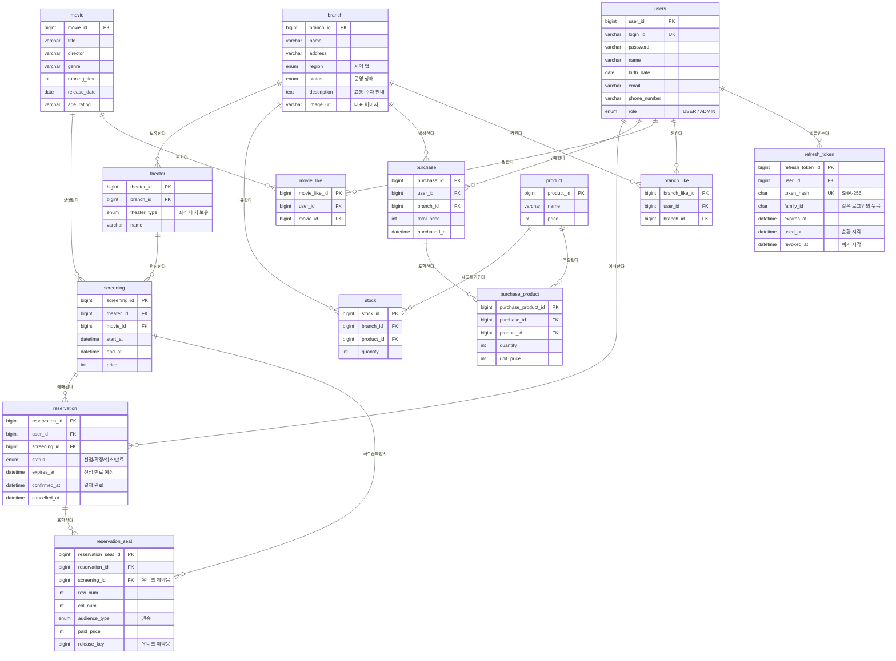
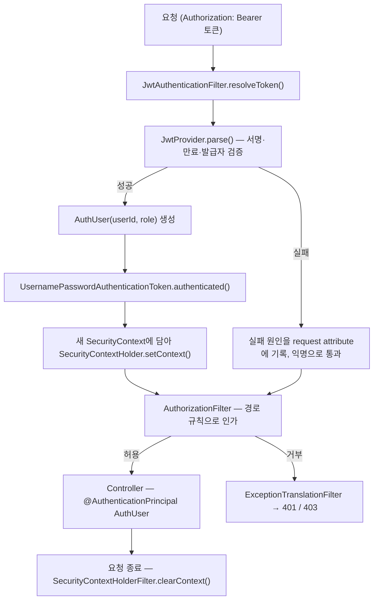

# spring-cgv-24th
CEOS 24기 백엔드 스터디 - CGV 클론 코딩 프로젝트

## ERD



모든 테이블은 `BaseTimeEntity`를 상속해 `created_at` / `updated_at`을 가집니다. 그림에서는 생략했습니다.
`region`, `status`, `theater_type`, `audience_type`은 테이블이 아니라 **자바 ENUM**이며 `varchar`로 저장됩니다.

## 테이블 정의

<details>
<summary><strong>user (회원)</strong></summary>

| 컬럼 | 타입 | 설명 |
|---|---|---|
| user_id | bigint (PK) | 식별자 |
| login_id | varchar(50) | 로그인 ID, 유니크. 영문 소문자·숫자 4~20자 |
| password | varchar(255) | BCrypt 해시 |
| name | varchar(50) | 이름 |
| birth_date | date | 생년월일 |
| email | varchar(100) | 이메일. 로그인에 쓰지 않아 유니크가 아닙니다 |
| phone_number | varchar(11) | 하이픈 없이 숫자만 저장합니다 |
| role | varchar(20) | 권한 (ENUM `Role`: USER / ADMIN) |
| created_at | datetime | 가입일시 |

**`Role`** — 회원가입은 항상 `USER`로 생성합니다. 가입 요청에는 role 필드가 없고, 빌더도 `USER`로 고정합니다. `ADMIN`은 `User.createAdmin()`으로만 만들어지며, 로컬 환경에서 기동 시 환경변수로 받은 계정 하나를 생성합니다.

**관계**
- `reservation` 1:N — 회원 한 명이 예매를 여러 건 합니다
- `purchase` 1:N — 회원 한 명이 구매를 여러 건 합니다
- `movie_like` 1:N — 회원 한 명이 영화를 여러 개 찜합니다
- `branch_like` 1:N — 회원 한 명이 지점을 여러 개 찜합니다
- `refresh_token` 1:N — 회원 한 명이 로그인(기기)마다 리프레시 토큰 묶음을 하나씩 가집니다. 재발급할 때마다 묶음에 행이 하나씩 늘어납니다

</details>

<details>
<summary><strong>branch (영화관 지점)</strong></summary>

| 컬럼 | 타입 | 설명 |
|---|---|---|
| branch_id | bigint (PK) | 식별자 |
| name | varchar(100) | 지점명 (예: CGV 홍대) |
| address | varchar(255) | 주소 |
| region | varchar(30) | 지역 탭 값 (ENUM `Region`) |
| status | varchar(20) | 운영 상태 (ENUM `BranchStatus`) |
| description | text | 교통·주차 안내 서술문 |
| image_url | varchar(500) | 대표 이미지 1장, nullable |

**`Region`** — 극장 목록 상단의 지역 탭. 선언 순서가 곧 노출 순서입니다.

| 값 | 표시명 |
|---|---|
| SEOUL / GYEONGGI / INCHEON / GANGWON | 서울 / 경기 / 인천 / 강원 |
| DAEJEON_CHUNGCHEONG / DAEGU | 대전·충청 / 대구 |
| BUSAN_ULSAN / GYEONGSANG | 부산·울산 / 경상 |
| GWANGJU_JEOLLA / JEJU | 광주·전라 / 제주 |

**`BranchStatus`**

| 값 | 표시명 | 목록 노출 |
|---|---|---|
| OPEN | 운영중 | O (예매 가능) |
| TEMPORARILY_CLOSED | 임시휴업 | O (배지 표시) |
| CLOSED | 운영종료 | X (상세 조회는 가능) |

**관계**
- `theater` 1:N — 지점 하나에 상영관이 여러 개 있습니다
- `stock` 1:N — 지점 하나가 상품별 재고를 여러 개 보유합니다
- `purchase` 1:N — 지점 하나에서 구매가 여러 건 발생합니다
- `branch_like` 1:N — 지점 하나를 여러 회원이 찜합니다

</details>

<details>
<summary><strong>TheaterType (상영관 종류) — 테이블이 아닌 ENUM</strong></summary>

상영관 종류는 대분류(일반관/특별관) 아래에 실제 종류가 놓이는 2단 구조입니다.
대분류는 `TheaterCategory`, 실제 종류는 `TheaterType`이 갖습니다.

| 값 | 표시명 | 대분류 | rowCount | colCount | 총 좌석 |
|---|---|---|---|---|---|
| STANDARD | 일반관 | GENERAL | 8 | 10 | 80 |
| IMAX | IMAX | SPECIAL | 12 | 22 | 264 |
| FOUR_DX | 4DX | SPECIAL | 10 | 16 | 160 |
| SCREEN_X | SCREENX | SPECIAL | 10 | 20 | 200 |

`theater.theater_type`에 `varchar(20)`으로 저장됩니다. `TheaterCategory`는
`TheaterType`이 결정하는 값이라 컬럼으로 저장하지 않습니다.

좌석 배치를 이 ENUM이 보유합니다. "종류가 같으면 좌석이 동일하다"는
요구사항에 따라 상영관마다 배치를 저장하지 않습니다. 종류가 고정된 소수이고
자체 속성이 행·열 두 개뿐이라 별도 테이블로 둘 이유가 없었습니다.
좌석 범위 검증도 `TheaterType.isValidSeat()`로 이 ENUM이 책임집니다.

</details>

<details>
<summary><strong>theater (상영관)</strong></summary>

| 컬럼 | 타입 | 설명 |
|---|---|---|
| theater_id | bigint (PK) | 식별자 |
| branch_id | bigint (FK) | 소속 지점 |
| theater_type | varchar(20) | 상영관 종류 (ENUM `TheaterType`) |
| name | varchar(50) | 관 이름 (예: 3관) |

**관계**
- `branch` N:1 — 상영관 여러 개가 지점 하나에 속합니다
- `TheaterType` — 종류는 ENUM이므로 조인 없이 컬럼으로 들고 있습니다
- `screening` 1:N — 상영관 하나에서 회차가 여러 번 열립니다

</details>

<details>
<summary><strong>movie (영화)</strong></summary>

| 컬럼 | 타입 | 설명 |
|---|---|---|
| movie_id | bigint (PK) | 식별자 |
| title | varchar(200) | 제목 |
| director | varchar(100) | 감독 |
| genre | varchar(50) | 장르 |
| running_time | int | 상영 시간(분) |
| release_date | date | 개봉일 |
| age_rating | varchar(20) | 관람 등급 |

**관계**
- `screening` 1:N — 영화 하나가 여러 회차로 상영됩니다
- `movie_like` 1:N — 영화 하나를 여러 회원이 찜합니다

</details>

<details>
<summary><strong>screening (상영 회차)</strong></summary>

| 컬럼 | 타입 | 설명 |
|---|---|---|
| screening_id | bigint (PK) | 식별자 |
| theater_id | bigint (FK) | 상영관 |
| movie_id | bigint (FK) | 영화 |
| start_at | datetime | 상영 시작 시각 |
| end_at | datetime | 상영 종료 시각 |
| price | int | 해당 회차 가격 |

**관계**
- `theater` N:1 — 회차 여러 개가 상영관 하나에서 열립니다
- `movie` N:1 — 회차 여러 개가 같은 영화를 상영합니다
- `reservation` 1:N — 회차 하나에 예매가 여러 건 있습니다
- `reservation_seat` 1:N — 중복 예매 방지용으로 직접 참조합니다

예매의 실제 대상은 영화가 아니라 이 회차입니다. 가격을 영화가 아닌 회차에
둔 것은 조조·심야 등 상영 조건에 따라 가격이 달라질 수 있기 때문입니다.

</details>

<details>
<summary><strong>reservation (예매)</strong></summary>

| 컬럼 | 타입 | 설명 |
|---|---|---|
| reservation_id | bigint (PK) | 식별자 |
| user_id | bigint (FK) | 예매자 |
| screening_id | bigint (FK) | 예매한 회차 |
| status | varchar(20) | 예매 상태 (ENUM `ReservationStatus`) |
| expires_at | datetime | 선점 만료 예정 시각 (좌석 선택 + 10분) |
| confirmed_at | datetime (null) | 결제 완료 시각 |
| cancelled_at | datetime (null) | 취소 시각 |

**관계**
- `user` N:1 — 여러 예매가 회원 한 명에 속합니다
- `screening` N:1 — 여러 예매가 회차 하나에 묶입니다
- `reservation_seat` 1:N — 예매 한 건에 좌석이 여러 개 있습니다

한 번의 예매에 여러 좌석이 선택될 수 있으므로 헤더-디테일 구조로
분리했습니다. 이 테이블은 "예매 행위"를 나타냅니다.

좌석을 고른 시각은 별도 컬럼 없이 `created_at`이 갖습니다.

</details>

<details>
<summary><strong>ReservationStatus (예매 상태) — 테이블이 아닌 ENUM</strong></summary>

| 값 | 표시명 | 좌석 |
|---|---|---|
| PENDING | 결제대기 | 점유 |
| RESERVED | 예매완료 | 점유 |
| CANCELLED | 취소 | 해제 |
| EXPIRED | 선점만료 | 해제 |

| from | to | 트리거 |
|---|---|---|
| — | PENDING | 좌석 선택 (10분간 선점) |
| PENDING | RESERVED | 결제 성공 |
| PENDING | CANCELLED | 결제 실패 / 사용자 취소 |
| PENDING | EXPIRED | 만료 시각 경과 |
| RESERVED | CANCELLED | 취소, 상영 20분 전까지 |

결제에 실패하면 좌석을 바로 놓습니다. 실패한 자리를 붙들고 재시도하게 두면 경쟁이 심한
회차에서 좌석 회전이 막힙니다. 실제 CGV도 결제에 실패하면 좌석 선택부터 다시 진행합니다.

만료를 `CANCELLED`와 분리한 이유는 사용자가 놓은 것과 시간이 지나 회수한 것의 원인이
다르기 때문입니다. 합치면 "이 좌석이 왜 풀렸나"를 되짚을 수 없습니다.

</details>

<details>
<summary><strong>AudienceType (권종) — 테이블이 아닌 ENUM</strong></summary>

| 값 | 표시명 | 할인율 | 기준가 14,000 기준 |
|---|---|---|---|
| ADULT | 일반 | 0% | 14,000 |
| YOUTH | 청소년 | 20% | 11,200 |
| PREFERENTIAL | 우대 | 50% | 7,000 |
| SENIOR | 경로 | 50% | 7,000 |

기준가는 `screening.price`가 갖고 권종은 거기서 얼마를 깎는지만 압니다. 가격표를 테이블로
두지 않은 이유는 값이 고정된 소수이고 자체 속성이 할인율 하나뿐이기 때문입니다.
`TheaterType`이 좌석 배치를 갖는 것과 같은 판단입니다.

좌석마다 권종이 붙습니다. 화면은 인원을 먼저 고르지만, 좌석-권종 매핑이 없으면 좌석별
금액을 정할 수 없습니다. 실제 티켓에도 좌석마다 권종이 찍힙니다.

</details>

<details>
<summary><strong>reservation_seat (예매 좌석)</strong></summary>

| 컬럼 | 타입 | 설명 |
|---|---|---|
| reservation_seat_id | bigint (PK) | 식별자 |
| reservation_id | bigint (FK) | 소속 예매 |
| screening_id | bigint (FK) | 회차 (유니크 제약용 중복 저장) |
| row_num | int | 좌석 행 위치 |
| col_num | int | 좌석 열 위치 |
| audience_type | varchar(20) | 권종 (ENUM `AudienceType`) |
| paid_price | int | 권종 할인이 적용된 결제 시점 가격 |
| release_key | bigint | 점유 중 0, 풀린 좌석은 자기 reservation_id |

**제약**: (screening_id, row_num, col_num, release_key) 유니크 — 중복 예매 방지

**관계**
- `reservation` N:1 — 여러 좌석이 예매 한 건에 속합니다
- `screening` N:1 — 유니크 제약을 위해 부모의 screening_id를 중복 저장합니다

좌석 테이블이 없으므로 위치를 행·열 숫자로 저장합니다.
`paid_price`는 회차 가격이 변경되어도 과거 결제 금액이 유지되도록
예매 시점 값을 복사한 것입니다.

취소·만료된 좌석도 행을 지우지 않고 `release_key`만 세웁니다.
어느 좌석을 얼마에 잡았는지가 남습니다.

</details>

<details>
<summary><strong>product (매점 상품)</strong></summary>

| 컬럼 | 타입 | 설명 |
|---|---|---|
| product_id | bigint (PK) | 식별자 |
| name | varchar(100) | 상품명 |
| price | int | 정가 |

**관계**
- `stock` 1:N — 상품 하나가 지점별 재고를 가집니다
- `purchase_product` 1:N — 상품 하나가 여러 구매 항목에 포함됩니다

"모든 영화관의 매점 메뉴는 같아요"에 따라 전 지점 공통으로 하나씩 존재합니다.

</details>

<details>
<summary><strong>stock (재고)</strong></summary>

| 컬럼 | 타입 | 설명 |
|---|---|---|
| stock_id | bigint (PK) | 식별자 |
| branch_id | bigint (FK) | 지점 |
| product_id | bigint (FK) | 상품 |
| quantity | int | 수량 |

**제약**: (branch_id, product_id) 유니크

**관계**
- `branch` N:1 — 여러 재고 항목이 지점 하나에 속합니다
- `product` N:1 — 여러 재고 항목이 상품 하나를 가리킵니다

지점과 상품의 N:M 관계를 푼 중간 테이블입니다. `quantity`라는 부가 속성이
있으므로 단순 연결이 아닌 독립 엔티티로 다룹니다.

</details>

<details>
<summary><strong>purchase (매점 구매)</strong></summary>

| 컬럼 | 타입 | 설명 |
|---|---|---|
| purchase_id | bigint (PK) | 식별자 |
| user_id | bigint (FK) | 구매자 |
| branch_id | bigint (FK) | 구매 지점 |
| total_price | int | 총 결제 금액 |
| purchased_at | datetime | 구매 시각 |

**관계**
- `user` N:1 — 여러 구매가 회원 한 명에 속합니다
- `branch` N:1 — 여러 구매가 지점 하나에서 발생합니다
- `purchase_product` 1:N — 구매 한 건에 상품 항목이 여러 개 있습니다

예매와 동일한 헤더-디테일 구조입니다. 환불이 없으므로 상태 컬럼을 두지 않았습니다.

</details>

<details>
<summary><strong>purchase_product (구매 상품)</strong></summary>

| 컬럼 | 타입 | 설명 |
|---|---|---|
| purchase_product_id | bigint (PK) | 식별자 |
| purchase_id | bigint (FK) | 소속 구매 |
| product_id | bigint (FK) | 상품 |
| quantity | int | 수량 |
| unit_price | int | 구매 시점 단가 |

**관계**
- `purchase` N:1 — 여러 상품 항목이 구매 한 건에 속합니다
- `product` N:1 — 여러 구매 항목이 상품 하나를 가리킵니다

</details>

<details>
<summary><strong>movie_like (영화 찜)</strong></summary>

| 컬럼 | 타입 | 설명 |
|---|---|---|
| movie_like_id | bigint (PK) | 식별자 |
| user_id | bigint (FK) | 회원 |
| movie_id | bigint (FK) | 영화 |
| created_at | datetime | 찜한 시각 |

**제약**: (user_id, movie_id) 유니크 — 중복 찜 방지

**관계**
- `user` N:1 — 여러 찜 항목이 회원 한 명에 속합니다
- `movie` N:1 — 여러 찜 항목이 영화 하나를 가리킵니다

</details>

<details>
<summary><strong>branch_like (지점 찜)</strong></summary>

| 컬럼 | 타입 | 설명 |
|---|---|---|
| branch_like_id | bigint (PK) | 식별자 |
| user_id | bigint (FK) | 회원 |
| branch_id | bigint (FK) | 지점 |
| created_at | datetime | 찜한 시각 |

**제약**: (user_id, branch_id) 유니크

**관계**
- `user` N:1 — 여러 찜 항목이 회원 한 명에 속합니다
- `branch` N:1 — 여러 찜 항목이 지점 하나를 가리킵니다

</details>

<details>
<summary><strong>refresh_token (리프레시 토큰)</strong></summary>

| 컬럼 | 타입 | 설명 |
|---|---|---|
| refresh_token_id | bigint (PK) | 식별자 |
| user_id | bigint (FK) | 회원 |
| token_hash | char(64) | 토큰 원문의 SHA-256 해시. 원문은 저장하지 않습니다 |
| family_id | char(36) | 같은 로그인에서 순환으로 이어진 토큰의 묶음 id(UUID). 로그인할 때 만들고 재발급한 토큰이 물려받습니다 |
| expires_at | datetime | 만료 시각 (로그인 시각 + `REFRESH_TOKEN_VALIDITY`). 재발급한 토큰도 같은 값을 물려받습니다 |
| used_at | datetime | 이 토큰으로 재발급받은 시각. 값이 있는 토큰이 다시 오면 재사용입니다 |
| revoked_at | datetime | 로그아웃이나 재사용 탐지로 폐기된 시각. null이면 폐기되지 않았습니다 |
| created_at | datetime | 발급 시각 |

**제약**: token_hash 유니크 — 받은 토큰을 해시해 한 행으로 바로 찾습니다
**인덱스**: `idx_refresh_token_family(family_id)` — 로그아웃·재사용 탐지 때 묶음 전체를 폐기하는 조회 조건입니다

**관계**
- `user` N:1 — 여러 토큰이 회원 한 명에 속합니다. 로그인마다 행이 하나씩 생겨 기기별로 따로 유지됩니다

</details>

---

## 다대다 관계 처리

개념적으로 N:M인 관계는 모두 중간 테이블로 분해했습니다.

| 개념적 관계 | 중간 테이블 | 부가 속성 |
|---|---|---|
| 회원 ↔ 영화 | `movie_like` | created_at |
| 회원 ↔ 지점 | `branch_like` | created_at |
| 지점 ↔ 상품 | `stock` | quantity |
| 구매 ↔ 상품 | `purchase_product` | quantity, unit_price |

JPA의 `@ManyToMany`는 조인 테이블에 부가 속성을 둘 수 없고 생성되는
쿼리를 예측하기 어렵습니다. 위 네 관계 모두 부가 속성이 필요하므로
중간 테이블을 독립 엔티티로 정의했습니다.

---

## 설계 판단 과정

### 용어 분리: 지점 vs 상영관

요구사항의 "영화관"이 두 의미로 쓰이고 있었습니다. CGV 홍대점 같은 **지점**(`branch`)과 그 안에서 실제로 영화를 트는 **상영관**(`theater`)을 한 테이블로 묶으면 이후 관계가 전부 꼬입니다. 특별관·일반관은 속성이 동일하므로 테이블을 나누지 않고 `theater_type`으로 종류를 구분했습니다. 이때 "특별관"은 IMAX·4DX·SCREENX를 묶는 대분류이지 종류 자체가 아니므로, 대분류는 `TheaterCategory`로 따로 두고 배치는 실제 종류가 갖습니다.

### 지점 목록·상세 화면에서 역산한 컬럼

초안의 `branch`는 `name`, `address` 두 개뿐이었습니다. 멘토 피드백(지역 / 운영 여부 / 설명 / 이미지)을 받고 실제 CGV 화면을 다시 보니, 빠진 것이 단순히 "표시할 값"이 아니라 **목록 화면의 필터·검색 축 자체**였습니다. 지역 탭도 검색창도 걸 컬럼이 없었습니다. 네 개를 각각 이렇게 결정했습니다.

#### 지역 — ENUM (테이블 아님)

탭 값은 `서울 / 경기 / 인천 / 강원 / 대전·충청 / 대구 / 부산·울산 / 경상 / 광주·전라 / 제주`입니다. 행정구역과 1:1이 아닙니다. "대전·충청"은 1광역시+3도를 묶은 것이고 "경상"은 대구·부산·울산을 뺀 나머지입니다.

처음에는 **행정구역이 아니니까 오히려 테이블이 필요한 것 아닌가** 생각했는데, 반대였습니다. 행정구역이라면 외부 표준 데이터를 따라가야 하므로 테이블이 맞습니다. 하지만 이 값은 CGV가 임의로 정한 묶음이라 **값의 소유자가 코드**입니다. 10개 내외에서 멈추고, 표시명과 정렬 순서 말고는 자체 속성도 없습니다.

| | ENUM (채택) | `region` 테이블 |
|---|---|---|
| 조회 | 조인 없음 | 목록 조회마다 조인 |
| 안전성 | 컴파일 타임에 오타가 잡힘 | 런타임 FK |
| 정렬 | 선언 순서 = 탭 순서 (컬럼 불필요) | `sort_order` 컬럼 필요 |
| 값 변경 | **배포 필요** | 운영자가 실시간 관리 |
| 지역명 검색 | **2단계** (아래) | SQL 한 방 |
| 확장 | 하위 지역·배너 붙이려면 이관 | 컬럼 추가로 끝 |

트레이드오프는 **지역명 검색**에서 나옵니다. DB에는 `BUSAN_ULSAN`만 있고 `"부산·울산"`은 코드에만 있으므로, 검색어를 먼저 `Region`으로 역변환한 뒤 `IN` 절에 넣어야 합니다.

```java
// Region.java — 표시명이 DB에 없으므로 키워드를 먼저 Region으로 바꾼다
public static List<Region> searchByKeyword(String keyword) {
    return Arrays.stream(values())
            .filter(region -> region.displayName.contains(keyword))
            .toList();
}
```

```java
// BranchRepository.java — 지점명 LIKE와 지역 IN을 OR로 묶는다
@Query("""
        SELECT b FROM Branch b
        WHERE b.status <> :excluded
          AND (b.name LIKE %:keyword% OR b.region IN :regions)
        ORDER BY b.region, b.name
        """)
List<Branch> searchByKeyword(@Param("keyword") String keyword,
                             @Param("regions") List<Region> regions,
                             @Param("excluded") BranchStatus excluded);
```

검색이 두 단계가 되는 비용을 치르고 조인과 참조 테이블 관리 비용을 덜어낸 선택입니다. 지역별 배너·하위 지역 같은 속성이 생기면 그때 테이블로 승격하면 되고, 이관은 10행 INSERT입니다.

#### 운영 여부 — boolean이 아니라 ENUM

`is_operating boolean`으로 충분한지 먼저 따져봤는데, **실제 상태가 두 개가 아니었습니다.** 운영중 / 임시휴업(리모델링) / 운영종료(폐관)가 모두 존재합니다.

결정적인 건 셋의 취급이 다르다는 점입니다. **임시휴업은 배지를 달고 목록에 남지만, 폐관은 목록에서 빠집니다.** boolean이면 `false`가 이 둘을 구분하지 못해 "목록에서 뺄지 말지"를 판단할 근거가 사라집니다. 표현력 부족이 실제 로직을 막는 겁니다.

부수적으로, 상태가 늘어날 때 boolean은 컬럼 추가(스키마 변경)지만 ENUM은 값 추가 한 줄입니다. CGV에 실재하는 "오픈예정"이 그 경우인데, 지금 화면 요구에 없어 넣지 않았습니다.

목록에서 제외할 상태는 서비스 상수로 한 곳에만 둡니다.

```java
// BranchService.java
private static final BranchStatus EXCLUDED_FROM_LIST = BranchStatus.CLOSED;
```

상세 조회는 상태로 거르지 않습니다. 폐관 지점 링크로 들어와도 "운영종료"를 보여주는 편이 404보다 낫다고 봤습니다.

#### 영화관 설명 — TEXT

실제 데이터를 먼저 봤습니다. 광주금남로점 기준으로 버스 노선 나열 + 지하철 출구 + 주차장 목록 + 정산 방법이 **줄바꿈과 불릿을 포함해 수백~2천 자**이고, 극장마다 내용이 완전히 다릅니다.

| 후보 | 판단 |
|---|---|
| `varchar(255)` | **불가.** 한 문단도 안 들어갑니다 |
| `varchar(2000)` | 가능하지만 utf8mb4에서 8000바이트를 행 크기 예산(65535B)에서 선점합니다. 인덱싱할 일도 없는 컬럼이 자리를 차지합니다 |
| **`text` (채택)** | 64KB. 값을 행 밖에 두므로 목록 조회 부담이 작습니다 |
| `@Lob` | **회피.** MySQL에서 `LONGTEXT`(4GB)로 매핑되고 Hibernate가 LOB 스트림 처리를 시도합니다. 실제 분량에 비해 과합니다 |

```java
// Branch.java
@Column(columnDefinition = "TEXT")
private String description;
```

**저장 형식**은 줄바꿈을 포함한 평문 그대로입니다. HTML을 저장하면 XSS 방어 책임이 서버로 넘어오므로, 렌더링은 클라이언트가 `white-space: pre-line`으로 처리하도록 남겨둡니다.

컬럼 타입만큼 중요한 게 **어디에 실어 보내느냐**입니다. `description`은 `BranchDetailResponse`에만 넣고 목록 DTO에서는 뺐습니다. 지점 30개 목록에 2KB씩 붙이면 응답이 60KB가 되는데, 목록 카드는 그 값을 쓰지 않습니다.

#### 이미지 URL — 컬럼 1개

상세 페이지 상단에 대표 이미지가 **정확히 1장**이고, 순서·캡션·타입 같은 부가 속성이 없습니다. 부가 속성 없는 1:N은 테이블로 뺄 이유가 없습니다. `stock`과 `purchase_product`를 독립 엔티티로 둔 기준(부가 속성이 있으니까)을 그대로 뒤집어 적용한 것입니다.

결정적이었던 건 **나중 비용이 낮다**는 점입니다. 갤러리 요구가 생기면 이관이 한 줄입니다.

```sql
INSERT INTO branch_image (branch_id, url, sort_order)
SELECT branch_id, image_url, 1 FROM branch WHERE image_url IS NOT NULL;
```

반대로 지금 테이블을 만들면 모든 상세 조회에 조인이 붙고, "대표 1장을 어떻게 고르나"(`is_main` 플래그? `sort_order = 1`?)라는 문제가 즉시 생깁니다. 요구가 없는데 먼저 치를 비용입니다.

`varchar(500)`은 CDN 경로에 쿼리스트링이 붙는 경우까지 고려한 길이이고, 이미지 미등록 지점을 허용하려고 nullable로 뒀습니다.

#### 특별관 라벨은 컬럼이 아니라 집계값

목록 카드의 `SCREENX`, `4DX` 같은 라벨은 지점 속성이 아니라 **그 지점이 보유한 상영관들의 타입을 집계한 값**입니다. `branch`에 컬럼으로 넣으면 `theater`와 이중 관리가 되어 반드시 틀어집니다.

다만 지점마다 조회하면 N+1이므로 `IN` + `GROUP BY`로 한 번에 집계합니다.

```java
// TheaterRepository.java
@Query("""
        SELECT t.branch.id AS branchId, t.theaterType AS theaterType
        FROM Theater t
        WHERE t.branch.id IN :branchIds
        GROUP BY t.branch.id, t.theaterType
        """)
List<BranchTheaterType> findTheaterTypesByBranchIds(@Param("branchIds") List<Long> branchIds);
```

지점이 몇 개든 목록 조회는 쿼리 2방(지점 1 + 라벨 집계 1)입니다. 대분류가 `GENERAL`인 종류는 라벨에서 빼기 때문에 일반관만 있는 지점은 라벨이 비는데, 실제 화면에서 라벨 없는 극장이 있는 것과 일치합니다. 한 지점이 특별관을 여러 종류 보유할 수 있어 라벨 순서는 `TheaterType` 선언 순서로 고정했습니다.

### 좌석 설계

"종류가 같다면 좌석은 동일해요"와 "직사각형, 중간에 비어있는 곳 없음" 두 단서로 설계를 결정했습니다. 좌석 테이블을 만들지 않고 `theater_type`에 `row_count`, `col_count`만 두었습니다. 지점 30개 × 상영관 8개여도 배치는 종류 수만큼만 저장됩니다.

트레이드오프: 범위 벗어난 좌석을 DB가 막지 못하므로 `TheaterType.isValidSeat()`로 애플리케이션에서 검증합니다. 좌석별 속성이 생기면 구조 변경이 필요합니다.

### 예매/구매를 두 테이블로 분리

한 번의 예매에 여러 좌석이 선택됩니다. 단일 테이블로 좌석마다 한 행씩 저장하면 같은 사람이 같은 회차를 두 번 나눠 예매한 경우를 구분하지 못해 취소 처리가 불가능합니다.

- `reservation` — 예매 행위 (누가, 언제, 어느 회차, 상태)
- `reservation_seat` — 선택한 좌석들 (행, 열, 가격)

매점 구매도 같은 상황이므로 `purchase` / `purchase_product`에 동일 구조를 적용했습니다.

### 가격을 시점별로 복사 저장

정가는 `screening.price`, `product.price`에 두되, 결제 시점 금액은 `reservation_seat.paid_price`, `purchase_product.unit_price`에 복사합니다. 원본 가격을 UPDATE하면 과거 결제 기록의 금액까지 바뀌기 때문입니다. 정규화 관점의 중복이지만 **과거 사실은 변하지 않아야 한다**는 원칙을 우선했습니다.

### 중복 예매 방지

`reservation_seat`에 유니크 제약을 걸었습니다. 애플리케이션 로직만으로는 동시 요청을 완전히 막을 수 없어 DB 차원의 최종 안전망이 필요합니다. 검사와 INSERT 사이의 틈은 원리적으로 막을 수 없고, 그 틈을 제약이 막습니다. 비관적 락은 쓰지 않습니다. 좌석 단위로 잠글 행이 없고(좌석 마스터 테이블이 없습니다), 회차 행을 잠그면 회차 단위로 직렬화되어 처리량이 크게 떨어집니다.

결제 전 선점(`PENDING`)도 좌석 행을 실제로 만듭니다. 그래야 같은 제약이 그대로 선점 잠금 역할을 합니다. 실제 CGV도 결제 전 선택 단계에서 남이 그 좌석을 잡지 못합니다.

이 제약은 취소와 충돌합니다. 취소된 좌석 행이 남으면 다른 사람이 같은 자리를 예매할 때 제약에 걸립니다. 행을 지우면 충돌은 풀리지만 어느 좌석을 취소했는지가 사라집니다. 그래서 **유니크 키에 `release_key`를 넣어 점유 중인 행만 유일**하게 만들었습니다.

```
UNIQUE (screening_id, row_num, col_num, release_key)

점유 중   release_key = 0
풀린 좌석 release_key = 자기 reservation_id
```

MySQL에 partial unique index가 없어 "점유 중인 행만 유일"을 직접 표현할 수 없습니다. 해제 값으로 `reservation_id`를 쓰면 한 예매가 같은 좌석을 두 번 가질 수 없으므로 풀린 행끼리 충돌하지 않습니다. 시각을 쓰면 같은 좌석이 동시에 해제될 때 충돌할 수 있습니다.

### 선점 만료

`reservation.expires_at`에 만료 예정 시각을 두고, 별도 스케줄러 없이 두 지점에서 처리합니다.

- **조회**는 시각 조건으로 거릅니다. 만료된 선점은 행이 남아 있어도 점유로 세지 않습니다.
- **좌석을 잡기 직전**에 요청한 좌석을 막고 있는 만료 선점만 실제로 해제합니다. 유니크 인덱스는 만료 시각을 모르므로, 행을 놓아주지 않으면 시간이 지난 좌석도 다시 잡을 수 없습니다. 회차 전체가 아니라 요청한 좌석으로 좁힌 이유는 아래 「좌석 경합 — 락의 범위와 순서」에 있습니다.
- **해제는 조건부 UPDATE로 합니다.** `status = PENDING`인 예매만 `EXPIRED`로, `release_key = 0`인 좌석만 해제 값으로 바꿉니다. 두 사람이 같은 만료 선점을 동시에 풀 때, 늦은 쪽의 UPDATE는 0행이 되고 아무것도 건드리지 않습니다. 조건 없이 같은 값으로 다시 덮어쓰면 InnoDB는 새 행 버전을 만들지 않습니다. 그러면 늦은 쪽의 스냅샷에서 예매는 `EXPIRED`인데 좌석은 `release_key = 0`인 엇갈린 상태가 보이고, 빈 좌석을 "이미 선택된 좌석"으로 거절했습니다. MySQL 컨테이너 테스트에서 간헐적으로 드러나 실험으로 원인을 확정했습니다(H2에서는 재현되지 않습니다).

정확성은 이 두 경로로 보장되므로 스케줄러는 "언젠가 정리된다"는 보조 수단일 뿐입니다. 시간 제어·테스트 비용만 늘어난다고 보고 넣지 않았습니다.

### 좌석 경합 — 락의 범위와 순서

유니크 제약에 동시성을 맡기면 경합이 붙었을 때 두 가지가 문제가 됩니다. **락을 어디까지 거는가(범위)**와 **어떤 순서로 거는가(순서)**입니다. 제약은 "같은 좌석이 두 번 팔리지 않는다"는 정확성만 지켜주고 이 둘은 지켜주지 않습니다.

#### 범위 — B3를 사려고 J12에 락을 걸던 문제

IMAX 1관은 12행 × 22열, 264석입니다. 만료된 선점 3건(A1 / E5 / J12)이 행으로 남아 있는 상태에서 민수가 **B3**를, 지연이 **J12**를 동시에 고른다고 합시다. 두 사람이 고른 좌석은 겹치지 않습니다.

처음에는 좌석을 잡기 직전에 **그 회차의** 만료 선점을 전부 해제했습니다. 민수의 트랜잭션이 A1·E5·J12를 모두 UPDATE하고 그 락을 **커밋할 때까지** 쥡니다. 지연은 J12 행 앞에서 민수를 기다립니다. 민수는 B3를 사려고 J12에 락을 건 셈입니다. 좌석이 264개인데 **경합 지점은 사실상 1곳**이었습니다.

그래서 정리 대상을 요청한 좌석으로 좁혔습니다. (행, 열) 쌍을 IN 절에 넣는 방법이 DB마다 달라 스칼라 하나로 접었습니다. 열 수는 상영관 종류 최대가 22라 100진 자리에서 겹치지 않습니다.

```sql
and exists(select 1 from reservation_seat rs1_0
  where rs1_0.reservation_id = r1_0.reservation_id
    and rs1_0.screening_id = ?
    and rs1_0.release_key = 0
    and ((rs1_0.row_num * 100) + rs1_0.col_num) in (?))
```

민수는 `[203]`(B3 = 2×100+3)으로 조회해 해당하는 만료 선점이 없으니 **UPDATE 0건, 락 0개**입니다. 지연은 `[1012]`(J12)로 자기에게 필요한 것만 풉니다. 두 사람은 서로를 만나지 않습니다.

A1과 E5를 둘 다 만료시킨 뒤 A1만 요청해 확인했습니다.

| 예매 | 좌석 | 요청 후 status | `updated_at` |
|---|---|---|---|
| 1 | A1 | PENDING → **EXPIRED** | 갱신됨 |
| 2 | E5 | **PENDING 그대로** | **요청 전과 소수점까지 동일** |

만료 시각이 지났어도 요청하지 않은 좌석은 읽지도 쓰지도 않습니다.

#### 순서 — 커플석 데드락

민수와 지연이 나란한 A1·A2를 동시에 노립니다. 민수는 화면에서 A1을 먼저 탭했고 지연은 A2를 먼저 탭했습니다. 요청 배열의 순서가 그대로 INSERT 순서가 되고, **INSERT 순서가 곧 락 획득 순서**입니다.

```
[정렬 전]
t1  민수  INSERT A1 → 획득
t2  지연  INSERT A2 → 획득
t3  민수  INSERT A2 → 지연이 쥠 → 대기 ┐
t4  지연  INSERT A1 → 민수가 쥠  → 대기 ┘  순환 → MySQL이 한쪽을 강제 종료 (1213)

[정렬 후] 둘 다 [A1, A2]
t1  민수  INSERT A1 → 획득
t2  지연  INSERT A1 → 민수 대기         (여기서 멈춥니다. A2는 건드리지 않습니다)
t3  민수  INSERT A2 → 획득 → 커밋
t4  지연  → 1062 중복 키 → 409 "이미 선택된 좌석입니다"
```

데드락은 순서가 엇갈릴 때만 생기므로, 모두에게 같은 순서를 강제하면 순환 자체가 불가능해집니다. 좌석을 (행, 열) 오름차순으로 정렬해 INSERT합니다.

여기에는 두 번째 문제가 딸려 있었습니다. 1213은 Spring에서 `DeadlockLoserDataAccessException`으로 번역되는데 이는 `ConcurrencyFailureException` 계열이라 `DataIntegrityViolationException` catch에 **걸리지 않습니다.** 사용자는 409 대신 **500**을 받았습니다. `SEAT_RESERVATION_CONFLICT`를 추가해 409로 매핑했습니다. 락 대기 타임아웃은 "좌석이 팔렸다"가 아니라 "판정하지 못했다"는 뜻이라 `SEAT_ALREADY_RESERVED`와 구분합니다.

정렬을 빼고 엇갈린 요청 6건을 동시에 던지면 **성공이 0건**입니다. 데드락 희생자는 통째로 롤백되고, 여러 순환 고리가 동시에 생기면 살아남을 뻔한 트랜잭션까지 끌려 들어갑니다. 좌석은 비어 있는데 아무도 사지 못합니다.

#### 왜 이것이 커넥션 문제로 번지는가

InnoDB는 중복 키 INSERT를 즉시 거절하지 않습니다. 선행 트랜잭션이 끝날 때까지 S 락을 걸고 **블로킹**합니다. 그동안 그 스레드는 **커넥션을 쥔 채** 기다립니다.

기본값은 `innodb_lock_wait_timeout` 50초, Hikari 풀 10개, `connection-timeout` 30초였습니다. 좌석 하나의 경합으로 커넥션 10개가 묶이면 11번째 요청부터는 엔드포인트와 무관하게 죽습니다. 락 한도가 커넥션 한도보다 길어 **경합과 상관없는 API가 경합 중인 API보다 먼저 죽는** 역전까지 있었습니다.

락 한도를 3초로 줄이고 풀을 20, `connection-timeout`을 3초로 맞췄습니다. MySQL 세션이 좌석 행을 12초간 쥔 상태에서 같은 좌석을 요청하면 **3.32초** 만에 409가 돌아옵니다. 같은 좌석으로 동시 30건을 던지는 동안에도 무관한 `/api/movies`는 **200, 8~9ms**를 유지했고, 30건의 결과는 **201 정확히 1건 + 409 29건**이었습니다.

---

## 한계 및 범위 밖으로 둔 것

### 구조적 한계

- **좌석 범위 검증**: 상영관 크기를 벗어난 좌석 예매를 DB가 막지 못합니다.
  좌석을 개별 행으로 저장하지 않은 선택의 결과이며, 애플리케이션에서
  `theater_type`의 행·열과 비교해야 합니다.
- **`release_key`의 의미**: 0이 "점유 중"을 뜻하는 것은 도메인 언어가 아니라
  유니크 제약을 위한 장치입니다. 컬럼만 보고는 뜻을 알 수 없어 주석이 필요합니다.
- **만료된 선점 행**: 만료 시각이 지나도 그 좌석을 요청하는 선점 요청이 오기 전까지는 행이
  `release_key = 0`인 채로 남습니다. 조회는 시각 조건으로 거르므로 점유로 세지는
  않지만, 테이블만 보면 풀린 좌석인지 바로 드러나지 않습니다.
- **회차 정보 중복**: `reservation_seat.screening_id`는 부모의 값과 항상
  일치해야 하지만 DB가 이를 보장하지 않습니다. 애플리케이션이 지켜야 합니다.
- **나이 제한 검증**: `movie.age_rating`과 생년월일 비교는 애플리케이션
  책임입니다.
- **지역 값 변경에 배포 필요**: `Region`을 ENUM으로 둔 대가입니다. 지점이
  새 지역에 생기면 코드를 고쳐야 합니다.
- **하위 지명으로는 지역 탭이 검색되지 않음**: `"충남"`으로 `"대전·충청"`이
  잡히지 않습니다. 표시명 부분일치 방식의 한계입니다. 별칭 목록을 ENUM에
  들려주면 해결되지만, 그 목록이 길어지면 테이블로 옮길 신호입니다.
- **설명 전문 검색 불가**: `description`은 `LIKE` 풀스캔 외에 검색 수단이
  없습니다. "주차 가능한 지점 찾기" 같은 요구가 생기면 전문 인덱스나
  구조화된 편의시설 테이블이 필요합니다.
- **대표 이미지 1장 제한**: 갤러리가 필요해지면 `branch_image` 테이블로
  이관해야 합니다.

### 의도적으로 제외한 것

- **잔여 좌석 수**: 실제 CGV는 회차별 잔여 좌석을 표시합니다. 매번
  계산하면 목록 조회 시 부담이 있어 반정규화 컬럼을 두는 방식이 일반적이나,
  예매·취소마다 정확한 갱신이 필요하고 동시성 문제가 따릅니다.
- **다중 장르·출연진**: 실제로는 영화 하나에 여러 장르와 다수의 배우가
  있으나 별도 테이블이 필요합니다. 현재는 `genre` 단일 컬럼으로 두었습니다.
- **좌석 등급, 할인·쿠폰, 결제 수단, 리뷰·평점**: 요구사항 범위 밖입니다.

### 지점에 더 필요해 보이지만 이번에 넣지 않은 것

피드백 4개를 반영하면서 같이 눈에 띈 것들입니다. 지금 화면 요구로는 정당화되지 않아 기록만 해둡니다.

| 후보 | 왜 필요할 수 있나 | 왜 지금은 아닌가 |
|---|---|---|
| `tel varchar(20)` | CGV 상세에 지점 연락처가 표시됨 | 넣어도 무방한 수준이지만 피드백 범위 밖 |
| 주소 분해 (도로명 / 상세 / 법정동) | 실제 표기가 3조각이고 검색 정확도가 다름 | 과제 범위에선 한 컬럼이 다루기 쉬움 |
| `opened_on` / `closed_on` | `status`는 *지금* 상태만 담고 전환 시점을 남기지 않음 | "오픈예정"을 도입할 때 같이 필요해짐 |
| 지점 코드 (CGV 내부 극장코드) | 외부 연동·딥링크·URL slug에서 PK 노출을 피함 | 연동 대상이 없음 |
| 이미지를 full URL이 아닌 key로 | CDN 도메인이 바뀌면 전 행 UPDATE | 단순함을 택함. 도메인 교체는 한 번의 UPDATE로 감당 가능 |
| 위경도 `decimal(10,7)` × 2 | "가까운 극장" 정렬 | 이번 범위 밖으로 명시됨 |

---

## 추가 질문 정리

### Dirty Checking은 왜 모든 컬럼을 UPDATE할까요 — @DynamicUpdate

Dirty Checking이 변경을 감지하면 변경된 필드만 골라 UPDATE하는 것이 아니라 **엔티티의 모든 컬럼**을 포함한 UPDATE 문을 실행합니다. JPA 구현체가 엔티티마다 단 하나의 고정된 UPDATE 쿼리를 미리 캐싱해두기 때문입니다. 매번 변경된 컬럼만 담은 쿼리를 만들면 DB의 prepared statement 캐시를 활용하기 어렵습니다.

컬럼 수가 많고 일부 컬럼만 자주 바뀌는 엔티티라면 `@DynamicUpdate`로 개선할 수 있습니다.

```java
@Entity
@DynamicUpdate
public class Reservation extends BaseTimeEntity { ... }
```

`@DynamicUpdate`를 붙이면 변경된 컬럼만 포함한 UPDATE 문을 생성합니다. 단, 쿼리가 매번 달라지므로 prepared statement 캐시 효율이 떨어집니다. 컬럼 수가 적거나 대부분 컬럼이 함께 바뀌는 엔티티라면 기본 동작이 더 효율적입니다.

### Flush가 발생하는 시점

Flush는 영속성 컨텍스트의 변경 사항을 DB에 반영하는 작업입니다. 트랜잭션 commit과 달리 flush 자체는 DB에 쿼리를 보내는 것일 뿐, 트랜잭션은 아직 유지됩니다.

발생 시점은 세 가지입니다.

1. **`em.flush()` 직접 호출** — 명시적으로 즉시 flush합니다.
2. **트랜잭션 commit 시** — commit 직전에 자동 flush 후 commit합니다.
3. **JPQL 쿼리 실행 직전** — FlushMode가 `AUTO`(기본값)일 때, JPQL 실행 전 영속성 컨텍스트와 DB의 정합성을 맞추기 위해 자동 flush합니다.

`@Transactional(readOnly = true)`는 내부적으로 FlushMode를 `MANUAL`로 설정합니다. 읽기 전용 트랜잭션에서는 변경이 없으므로 flush 자체를 막아 불필요한 dirty checking 비용을 제거합니다.

### 영속성 컨텍스트 · 엔티티 매니저 · 트랜잭션은 항상 1:1로 대응할까요

항상 1:1은 아닙니다. Spring JPA의 기본 전략은 **트랜잭션 범위 영속성 컨텍스트**입니다. 트랜잭션 하나가 시작되면 영속성 컨텍스트가 하나 생성되고, 트랜잭션이 끝나면 영속성 컨텍스트도 종료됩니다. 이 범위 안에서는 같은 식별자로 조회하면 항상 같은 인스턴스를 반환합니다(1차 캐시).

엔티티 매니저와 트랜잭션도 기본적으로 1:1이지만 실제 동작은 다릅니다. **`SimpleJpaRepository`처럼 싱글톤 빈에 주입된 `EntityManager`는 실제 객체가 아니라 Spring이 `SharedEntityManagerCreator`로 만든 프록시입니다.** 이 프록시가 메서드 호출 시점에 현재 스레드에 바인딩된 실제 `EntityManager`를 찾아 위임합니다. 싱글톤이지만 각 요청(트랜잭션)마다 다른 `EntityManager`가 동작하는 이유입니다.

확장된 영속성 컨텍스트(OSIV 등)에서는 여러 트랜잭션에 걸쳐 하나의 영속성 컨텍스트가 유지될 수도 있습니다.

### SQL JOIN과 JPQL JOIN의 기준 차이

SQL은 **테이블 간 물리적 컬럼**을 기준으로 조인합니다. ON 절에 조인 조건을 직접 명시해야 합니다.

```sql
-- SQL: 조인 조건을 직접 작성
SELECT * FROM reservation r
JOIN screening s ON r.screening_id = s.screening_id
```

JPQL은 **객체의 연관관계 필드**를 기준으로 조인합니다. FK 설정이 이미 엔티티 매핑에 선언되어 있으므로 ON 절 없이 필드명만 씁니다.

```java
// JPQL: 연관관계 필드명으로 조인
SELECT r FROM Reservation r JOIN r.screening s
```

`r.screening`은 `Reservation` 엔티티의 연관관계 필드입니다. Hibernate가 이 매핑 정보를 읽어 적절한 SQL ON 절을 자동 생성합니다. `JOIN FETCH`는 JPQL에만 있는 개념으로, SQL로는 평범한 INNER JOIN으로 번역되지만 JPA 차원에서 연관 엔티티를 즉시 초기화합니다.

### 프록시 (Proxy)

**프록시란 무엇인가요**

`@ManyToOne(fetch = LAZY)` 설정 시 연관 엔티티를 즉시 조회하지 않고 실제 데이터가 필요한 순간까지 미룹니다. 이때 JPA는 실제 엔티티 대신 **프록시 객체**를 반환합니다. 프록시는 실제 엔티티 클래스를 상속해 Hibernate가 런타임에 생성한 가짜 객체로, 처음에는 id만 들고 있다가 다른 필드에 접근하는 순간 DB에서 실제 데이터를 조회(초기화)합니다.

**프록시와 N+1 문제의 관계**

LAZY 로딩으로 프록시를 받은 후 루프에서 각 프록시를 초기화하면 N번의 추가 SELECT가 발생합니다.

```java
List<Reservation> list = reservationRepository.findAll();  // SELECT 1번
for (Reservation r : list) {
    r.getScreening().getStartAt();  // 프록시 초기화 → SELECT N번
}
```

fetch join으로 연관 엔티티를 미리 함께 로딩하거나, `@BatchSize`로 IN 절 배치 조회하는 것이 해결책입니다.

**Hibernate Proxy vs Spring AOP Proxy**

| | Hibernate Proxy | Spring AOP Proxy |
|---|---|---|
| 생성 방식 | CGLIB로 엔티티 클래스를 상속 | CGLIB 상속 또는 JDK 동적 프록시(인터페이스) |
| 목적 | LAZY 로딩 (DB 조회 지연) | AOP 적용 (트랜잭션, 로깅 등) |
| 생성 시점 | 연관 엔티티 조회 시 | 빈 등록 시 |
| 클래스명 예시 | `Screening$HibernateProxyXXX` | `ReservationService$$SpringCGLIB$$0` |

둘 다 CGLIB 바이트코드 조작 기술을 활용하지만 목적과 생성 주체가 다릅니다.

### CGLIB
1주차 발표 때 질문 받았던 사항이고 제대로 알아보지 않아 추가 정리해보았습니다.

CGLIB(Code Generation Library)는 런타임에 바이트코드를 조작해 **클래스의 서브클래스를 동적으로 생성**하는 라이브러리입니다. Spring은 `@Transactional` 같은 AOP 기능을 적용할 때 대상 클래스를 상속한 CGLIB 프록시 클래스를 만들어 빈으로 등록합니다.

컨트롤러에서 `@RequiredArgsConstructor`로 주입받는 서비스 객체는 실제 `ReservationService`가 아니라 CGLIB가 만든 프록시입니다.

```java
// ReservationController
private final ReservationService reservationService;

// 실제 타입 확인
System.out.println(reservationService.getClass().getName());
// → com.ceos24.cgv.service.ReservationService$$SpringCGLIB$$0
```

프록시는 `ReservationService`를 상속했으므로 외부에서는 일반 객체와 구분이 되지 않습니다. 메서드가 호출되면 프록시가 트랜잭션 시작/종료 같은 부가 로직을 끼워 넣은 뒤 원본 메서드로 위임합니다.

CGLIB 프록시가 생성되려면 클래스에 기본 생성자가 필요하고 메서드가 `final`이면 안 됩니다. `final` 메서드는 오버라이드할 수 없어 프록시가 끼어들지 못합니다.

### SimpleJpaRepository의 EntityManager 주입이 동작하는 방식

`SimpleJpaRepository`는 싱글톤 빈입니다. 그런데 생성자 주입으로 `EntityManager`를 받습니다. `EntityManager`는 요청(트랜잭션)마다 생성되는 객체인데, 싱글톤에 한 번만 주입하면 어떻게 요청마다 다른 세션이 동작할까요?

답은 **주입되는 `EntityManager` 자체가 프록시**이기 때문입니다. Spring은 `SharedEntityManagerCreator`가 만든 프록시 `EntityManager`를 주입합니다.

```java
// SimpleJpaRepository (Spring Data JPA 내부)
public SimpleJpaRepository(JpaEntityInformation<T, ?> entityInformation, EntityManager entityManager) {
    this.em = entityManager;  // 실제로는 프록시가 주입됨
}
```

`this.em.find(...)` 같이 호출하면 프록시가 현재 스레드에 바인딩된 트랜잭션 컨텍스트를 조회하고, 거기서 실제 `EntityManager`를 꺼내 위임합니다. 싱글톤이지만 각 요청이 자신의 영속성 컨텍스트를 갖게 되는 이유입니다.

### fetch join 사용 시 알아두어야 할 것들

**컬렉션 fetch join과 DISTINCT**

1:N 관계를 fetch join하면 SQL 결과에서 1 쪽 행이 N 개만큼 중복됩니다. `Reservation` 1건에 `ReservationSeat` 3개가 있으면 SQL 결과는 `Reservation` 행 3개입니다.

```java
SELECT r FROM Reservation r JOIN FETCH r.seats
```

그렇다고 Java 목록에 `Reservation`이 3번 들어오지는 않습니다. Hibernate 6(Spring Boot 3.x)부터 **엔티티 목록의 중복 제거는 항상 자동**이고, 이를 끄던 `hibernate.query.passDistinctThrough` 옵션 자체가 없어졌습니다.

반면 JPQL에 쓴 `DISTINCT`는 SQL로 그대로 전달됩니다. 중복 제거 효과는 달라지지 않는데 조인 결과 전체에 `DISTINCT`를 거는 비용만 남습니다. 그래서 이 프로젝트의 fetch join 쿼리에는 `DISTINCT`를 쓰지 않습니다. 중복 제거가 목적이 아니라 DB에 실제로 `DISTINCT`가 필요한 집계라면 그때는 의미가 있습니다.

**HHH000104 — fetch join과 페이징을 동시에 쓰면 안 됩니다**

```
HHH000104: firstResult/maxResults specified with collection fetch; applying in memory!
```

컬렉션 fetch join + 페이징(`setFirstResult` / `setMaxResults`)을 동시에 사용하면 DB에서 페이징을 적용할 수 없습니다. Hibernate는 전체 데이터를 메모리에 올린 후 Java에서 페이징을 처리하며, 데이터가 많을수록 OOM 위험이 커집니다.

해결책은 ToOne 관계만 fetch join하고 컬렉션은 `@BatchSize` 또는 `hibernate.default_batch_fetch_size`로 IN 절 배치 로딩하거나, 부모 페이징 후 자식을 별도 쿼리로 분리하는 것입니다.

**fetch join에서 발생하는 3가지 에러**

*(1) HHH000104* — 위의 페이징 문제와 동일합니다. 예외가 아닌 경고지만 운영 환경에서 치명적입니다.

*(2) owner of the fetched association was not present in the select list*

```
query specified join fetching, but the owner of the fetched association was not present in the select list
```

fetch join한 연관 엔티티의 소유자(부모)가 SELECT 절에 없을 때 발생합니다.

```java
// 잘못된 예: Screening은 select하지 않고 theater를 fetch join
SELECT s.movie FROM Screening s JOIN FETCH s.theater
```

fetch join의 소유자(`Screening`)가 SELECT에 없으므로 Hibernate가 `theater`를 어디에 붙여야 할지 알 수 없습니다. SELECT 절에 루트 엔티티를 포함해야 합니다.

*(3) MultipleBagFetchException*

```
org.hibernate.loader.MultipleBagFetchException: cannot simultaneously fetch multiple bags
```

`List` 타입 컬렉션 2개 이상을 동시에 fetch join하면 카테시안 곱이 발생합니다. Hibernate는 이를 막기 위해 예외를 던집니다.

```java
// 예외 발생: List 컬렉션 2개를 동시에 fetch join
SELECT r FROM Reservation r
JOIN FETCH r.seats
JOIN FETCH r.someOtherList
```

해결책은 컬렉션 중 하나를 `Set`으로 변경하거나, fetch join을 하나만 유지하고 나머지는 `@BatchSize`로 지연 로딩하는 것입니다.

---

## 배운점 및 느낀점

### ORM과 JPA — 엔티티가 상태를 스스로 지킨다

JPA를 쓰면 객체를 DB 행처럼 다루고 싶어지는 유혹이 생깁니다. `@Setter`를 열어두고 서비스에서 필드를 직접 건드리는 방식입니다. 이렇게 하면 "어떤 이유로 이 필드가 바뀌었는지"를 코드에서 추적할 수 없게 됩니다.

대신 엔티티에 의도가 드러나는 메서드를 두고, 상태 변경은 전부 그 메서드를 통하게 했습니다. 생성자는 `private` + `@Builder`, 기본 생성자는 `@NoArgsConstructor(PROTECTED)`로 외부에서 빈 객체가 만들어지지 않도록 막았습니다.

```java
// Reservation.java
public void cancel(LocalDateTime now) {
    if (this.status == ReservationStatus.CANCELLED) {
        throw new CustomException(ErrorCode.ALREADY_CANCELLED);
    }
    if (this.status == ReservationStatus.EXPIRED) {
        throw new CustomException(ErrorCode.RESERVATION_EXPIRED);
    }
    if (this.status == ReservationStatus.RESERVED && !isCancellableAt(now)) {
        throw new CustomException(ErrorCode.CANCEL_DEADLINE_PASSED);
    }
    this.status = ReservationStatus.CANCELLED;
    this.cancelledAt = now;
    releaseSeats();
}
```

취소 가능 여부 판단부터 좌석 해제까지 엔티티 안에서 끝납니다. 서비스는 소유자 조건으로 예매를 찾아 `cancel()`을 부를 뿐입니다. 좌석 행은 지우지 않고 `release_key`만 바꿔 어느 좌석을 얼마에 잡았는지 남깁니다(「중복 예매 방지」 참고). 현재 시각은 `Clock` 빈에서 받아 인자로 넘기므로 "상영 20분 전" 같은 경계를 테스트에서 만들 수 있습니다. 수정한 엔티티를 따로 `save()`하지 않아도 트랜잭션 커밋 시 dirty checking이 부모와 자식 행의 변경을 감지해 UPDATE를 실행합니다.

### 로딩 전략과 N+1 문제 — fetch join으로 조회 형태에 맞춘다

모든 `@ManyToOne`을 `LAZY`로 설정했습니다. 기본값인 `EAGER`는 연관 엔티티를 항상 끌어오므로, 필요하지 않은 조인이 늘 실행됩니다. `LAZY`는 실제로 접근하는 순간 SELECT를 날리는데, 루프 안에서 접근하면 행 수만큼 쿼리가 나가는 N+1 문제가 생깁니다.

해결책은 조회 API의 응답 형태를 먼저 정하고, 필요한 연관만 fetch join으로 한 번에 가져오는 것입니다.

```java
// ReservationRepository.java
@Query("""
        SELECT r FROM Reservation r
        JOIN FETCH r.screening s
        JOIN FETCH s.movie
        JOIN FETCH s.theater t
        JOIN FETCH t.branch
        LEFT JOIN FETCH r.seats
        WHERE r.id = :id AND r.user.id = :userId
        """)
Optional<Reservation> findOwnedWithDetails(@Param("id") Long id, @Param("userId") Long userId);
```

`r.user.id` 조건은 소유권 검사입니다. 남의 예매는 아예 로딩되지 않습니다. `user`를 조인하지 않은 것은 의도입니다. 응답이 사용자를 id로만 쓰는데, 프록시의 id getter는 초기화 없이 식별자를 돌려주므로 조인해도 쿼리가 줄지 않습니다(`ReservationQueryCountTest`로 실측했습니다). 이름 같은 다른 필드를 응답에 실으면 그때 fetch join을 더해야 합니다. 컬렉션 fetch join이 2개 이상이면 `MultipleBagFetchException`이 발생하므로, 그 경우에는 각각 별도 쿼리로 조회한 뒤 조립해야 합니다. 회차 목록의 잔여좌석 카운트는 IN 절 + GROUP BY로 한 번에 집계해(`countGroupedByScreeningIds`) N+1을 방지했습니다.

### REST API — 자원 URL + HTTP 메서드 + 상태 코드

REST는 URL이 자원을 가리키고, 행위는 HTTP 메서드로 표현하는 설계입니다. `/reservations/cancel/{id}` 같은 동사 URL 대신 `/reservations/{id}`에 DELETE를 보내는 방식입니다.

```java
// ReservationController.java
@PostMapping
@ResponseStatus(HttpStatus.CREATED)
public ApiResponse<ReservationResponse> create(@AuthenticationPrincipal AuthUser authUser,
                                               @Valid @RequestBody ReservationCreateRequest req) {
    return ApiResponse.success(reservationService.create(authUser.userId(), req));
}

@DeleteMapping("/{id}")
public ApiResponse<Void> cancel(@AuthenticationPrincipal AuthUser authUser,
                                @PathVariable Long id) {
    reservationService.cancel(id, authUser.userId());
    return ApiResponse.success();
}
```

`ResponseEntity`로 감싸지 않고 공통 응답 `ApiResponse`로 DTO를 감싸 반환하며, 상태 코드는 `@ResponseStatus`로 표현했습니다. 예매자는 요청 본문이 아니라 토큰에서 꺼낸 `AuthUser`로 정하고, 서비스에는 `userId`만 넘겨 서비스가 인증 방식을 모르게 했습니다. 요청 검증은 `@Valid` + record 필드의 `@NotNull`/`@Min`으로 컨트롤러 진입 직후에 끝냅니다. 검증이 실패하면 `MethodArgumentNotValidException`이 발생하고 전역 핸들러가 400으로 처리합니다.

### 예외 처리 — 도메인 예외를 하나로 모아 응답 형식을 통일

서비스와 도메인은 `CustomException(ErrorCode)`만 던지고, `@RestControllerAdvice`인 `GlobalExceptionHandler`가 HTTP 응답으로 변환합니다. `IllegalStateException` 같은 표준 예외를 직접 던지면 응답 형식을 통제할 수 없습니다.

```java
// GlobalExceptionHandler.java
@ExceptionHandler(CustomException.class)
public ResponseEntity<ApiResponse<Void>> handleCustom(CustomException e) {
    ErrorCode code = e.getErrorCode();
    log.warn("[CustomException] {}: {}", code.name(), e.getMessage());
    return ResponseEntity.status(code.getHttpStatus())
                         .body(ApiResponse.error(code));
}
```

`ErrorCode` enum이 `HttpStatus`와 메시지를 함께 들고 있습니다. 새 오류를 추가할 때 enum에 한 줄만 추가하면 핸들러 코드는 변경하지 않아도 됩니다. 핸들러는 도메인 오류, 요청 검증·바인딩 오류(400), 예상치 못한 오류(500)로 나누고 로그 레벨(`warn` vs `error`)도 구분합니다. 단, 인증·인가 실패는 `DispatcherServlet`에 닿기 전 필터 단계에서 일어나 이 핸들러가 잡지 못합니다. 그래서 `SecurityErrorResponder`가 같은 `ApiResponse` 형식으로 응답을 직접 씁니다.

### Spring MVC 흐름 — DispatcherServlet → Controller → Service → Repository

요청은 `DispatcherServlet`이 받아서 URL과 HTTP 메서드로 핸들러를 고르고, `@RequestMapping`이 달린 컨트롤러 메서드로 전달합니다. 컨트롤러는 HTTP 관심사(검증, DTO 매핑)만 담당하고 비즈니스 로직은 서비스로 위임합니다.

3주차에 Spring Security를 도입하면서 `DispatcherServlet` 앞에 필터 체인이 생겼습니다. `JwtAuthenticationFilter`가 토큰을 검증해 `SecurityContext`에 사용자를 넣고, `AuthorizationFilter`가 경로 규칙으로 요청을 거부하거나 통과시킵니다. 컨트롤러는 `@AuthenticationPrincipal`로 인증된 사용자를 받습니다. 자세한 순서는 「인증·인가」에 정리했습니다. 인터셉터는 아직 쓰지 않습니다.

### 레이어드 아키텍처 — 의존 방향을 한쪽으로

Controller → Service → Repository 단방향 의존입니다. 상위 계층은 하위를 알지만 하위는 상위를 모릅니다. 이 원칙에서 세 가지 규칙이 파생됩니다.

첫째, 컨트롤러가 엔티티를 보면 안 됩니다. 서비스는 항상 DTO를 반환합니다.

```java
// ReservationService.java
public ReservationResponse getById(Long id, Long userId) {
    List<ReservationDetailRow> rows = reservationRepository.findOwnedDetailRows(id, userId);
    if (rows.isEmpty()) {
        throw new CustomException(ErrorCode.RESERVATION_NOT_FOUND);
    }
    return ReservationResponse.of(rows, LocalDateTime.now(clock));
}
```

조회는 상태를 바꾸지 않으므로 엔티티 대신 응답에 필요한 컬럼만 담은 프로젝션(`ReservationDetailRow`)으로 읽습니다.

둘째, 엔티티·프로젝션→DTO 변환은 DTO의 정적 팩토리(`ReservationResponse.from`, `of`)가 소유합니다. 서비스는 조립 순서만 정하고 매핑 규칙은 DTO 파일 안에 있어, 응답 형태가 바뀌어도 서비스 코드는 변하지 않습니다.

셋째, 트랜잭션 경계는 서비스 계층이 책임집니다. 클래스 레벨에 `@Transactional(readOnly = true)`를 두고 쓰기 메서드에만 `@Transactional`을 추가해 기본값을 오버라이드합니다. 읽기와 쓰기의 트랜잭션을 명시적으로 분리함으로써 불필요한 flush와 dirty checking 비용을 막습니다.

### 서비스 단위 테스트 — Mock으로 비즈니스 로직만 검증한다

이전 프로젝트에서는 테스트 코드를 거의 작성해본 적이 없었습니다. 이번에 처음으로 단위 테스트를 제대로 작성해보면서, 테스트가 단순히 "동작 확인용"이 아니라 코드 설계를 검증하는 수단이라는 걸 느꼈습니다.

서비스 단위 테스트는 `@ExtendWith(MockitoExtension.class)`와 `@Mock` / `@InjectMocks`를 조합해 외부 의존성(DB, 다른 서비스)을 전부 Mock으로 대체합니다. 덕분에 순수하게 비즈니스 로직만 빠르게 검증할 수 있습니다.

```java
// ReservationServiceTest.java
@Test
void 없는_회차면_SCREENING_NOT_FOUND() {
    given(screeningRepository.findByIdWithDetails(1L)).willReturn(Optional.empty());

    assertThatThrownBy(() -> service.create(1L, reqOf(1L, new int[]{1, 1})))
            .isInstanceOf(CustomException.class)
            .extracting("errorCode").isEqualTo(ErrorCode.SCREENING_NOT_FOUND);
    verify(userRepository, never()).findById(any());
}
```

`BDDMockito.given().willReturn()`으로 의존 객체의 동작을 사전에 정의하고, `assertThatThrownBy().extracting()`으로 예외 타입과 에러코드를 한 번에 검증합니다. `verify(userRepository, never())`는 회차 조회가 실패하면 회원 조회 자체가 호출되지 않아야 한다는 것을 보장합니다. 성공 케이스뿐 아니라 이런 "호출되면 안 된다"는 보장도 테스트로 표현할 수 있다는 점이 인상적이었습니다.

저장된 객체의 내부 상태를 검증할 때는 `ArgumentCaptor`를 활용합니다. `reservationRepository.saveAndFlush()`에 넘겨진 `Reservation` 객체를 직접 꺼내서 좌석 수, 각 좌석의 `paidPrice` 등을 확인할 수 있습니다.

`@Setter` 없이 `private` 생성자만 허용하는 엔티티에 테스트용 id를 넣어야 할 때는 `ReflectionTestUtils.setField()`를 사용했습니다. 운영 코드의 불변 설계를 깨지 않으면서 테스트에서만 필드를 강제 주입하는 방법입니다.

### 컨트롤러 통합 테스트 — 실제 HTTP 요청처럼 end-to-end 검증한다

서비스 단위 테스트가 비즈니스 로직을 검증한다면, 컨트롤러 통합 테스트는 요청이 들어와서 응답이 나가기까지의 전체 흐름을 검증합니다. 공통 설정은 추상 베이스 클래스에 모아두고 각 테스트 클래스가 상속합니다.

```java
// ControllerIntegrationTest.java
@SpringBootTest
@Transactional
public abstract class ControllerIntegrationTest {

    protected MockMvc mockMvc;

    @Autowired protected EntityManager em;
    @Autowired private WebApplicationContext wac;
    @Autowired private JwtProvider jwtProvider;

    @BeforeEach
    void setUpMockMvc() {
        mockMvc = MockMvcBuilders.webAppContextSetup(wac).apply(springSecurity()).build();
    }

    protected <T> T persist(T entity) {
        em.persist(entity);
        return entity;
    }

    protected void flushAndClear() {
        em.flush();
        em.clear();
    }

    protected RequestPostProcessor bearer(User user) {
        return request -> {
            request.addHeader(HttpHeaders.AUTHORIZATION,
                    "Bearer " + jwtProvider.createAccessToken(user.getId(), user.getRole()));
            return request;
        };
    }
}
```

`apply(springSecurity())`가 있어야 MockMvc 요청이 Security 필터 체인을 탑니다. 빠지면 토큰을 보내도 필터가 풀지 않아, 보호 API가 401이 아니라 principal이 null인 채 컨트롤러까지 가서 500이 됩니다. `bearer(user)`는 요청을 보내는 순간 실제 `JwtProvider`로 토큰을 발급해 헤더에 넣습니다.

`@Transactional`을 베이스 클래스에 붙여두면 테스트가 끝난 뒤 자동으로 롤백됩니다. 각 테스트가 서로의 데이터를 오염시키지 않으므로 독립성을 보장합니다.

`flushAndClear()`는 `em.flush() + em.clear()`의 조합입니다. flush로 변경 사항을 DB에 반영한 뒤 clear로 1차 캐시를 비우면, 이후 조회가 캐시 대신 실제 DB에서 읽어오므로 "실제로 저장됐는지"를 검증할 수 있습니다. 특히 좌석 현황 조회처럼 DB에서 집계한 결과를 확인할 때 반드시 필요했습니다.

실제 테스트 메서드는 `MockMvc`로 HTTP 요청을 보내고 `jsonPath`로 응답 JSON을 검증합니다.

```java
// ReservationControllerTest.java
@Test
void 좌석_선점_성공() throws Exception {
    mockMvc.perform(post("/api/reservations").with(bearer(user))
                    .contentType(MediaType.APPLICATION_JSON)
                    .content("""
                            {"screeningId":%d,"seats":[
                              {"rowNum":1,"colNum":1,"audienceType":"ADULT"},
                              {"rowNum":1,"colNum":2,"audienceType":"YOUTH"}]}
                            """.formatted(screening.getId())))
            .andExpect(status().isCreated())
            .andExpect(jsonPath("$.data.userId").value(user.getId()))
            .andExpect(jsonPath("$.data.status").value("PENDING"))
            .andExpect(jsonPath("$.data.seats.length()").value(2))
            .andExpect(jsonPath("$.data.totalPrice").value(25200));
}
```

테스트 데이터 생성은 `TestFixtures` 클래스에 정적 팩토리 메서드로 모아두었습니다. 테스트마다 Builder를 반복 작성하지 않고 `TestFixtures.branch("강남점")` 한 줄로 의미 있는 이름의 픽스처를 만들 수 있어 가독성이 높아졌습니다.

---

## JWT 인증 흐름 정리

3주차 과제 1번 질문에 대한 정리입니다. 각 항목 끝에 이 프로젝트의 실제 코드 위치를 적었습니다. 경로는 `src/main/java/com/ceos24/cgv/` 아래 기준입니다.

### 1. JWT의 헤더, 페이로드, 서명은 각각 어떤 역할을 하나요?

**핵심** 헤더는 토큰을 어떻게 검증할지, 페이로드는 토큰이 무엇을 주장하는지 담고, 서명은 그 둘이 바뀌지 않았음을 증명합니다.

**설명**

| 구성요소 | 역할 | 들어가는 값 |
|---|---|---|
| 헤더 | 토큰을 어떻게 검증해야 하는지 알려주는 정보 | 서명 알고리즘(`alg`), 토큰 종류(`typ`), 키가 여러 개면 서명한 키(`kid`) |
| 페이로드 | 토큰이 주장하는 내용, 즉 클레임 | 누구의 토큰인지(`sub`), 언제 만료되는지(`exp`), 누가 발급했는지(`iss`) 등 |
| 서명 | 헤더와 페이로드가 바뀌지 않았다는 증명 | 인코딩된 헤더와 페이로드를 점으로 이은 문자열을 비밀키로 서명한 값 |

서버는 받은 토큰의 앞 두 부분으로 서명을 다시 계산해 비교하고, 한 글자라도 바뀌었으면 불일치로 변조를 잡아냅니다.

헤더와 페이로드는 암호화가 아니라 `Base64URL` 인코딩일 뿐이라 누구나 디코딩해서 읽을 수 있습니다. 서명은 "내용이 바뀌지 않았고 우리 서버가 발급했다"는 무결성만 보장하고 내용을 숨겨주지 않습니다. 그래서 비밀번호나 개인정보를 넣으면 안 됩니다. 내용까지 숨기려면 `JWE`라는 별도 규격을 써야 합니다.

**우리 프로젝트에서는**

`JwtProvider.createAccessToken()`이 발급한 토큰의 앞 두 부분을 디코딩한 예시입니다(테스트 설정으로 발급, 서명 부분 생략).

```
header   {"alg":"HS256"}
payload  {"sub":"1","role":"USER","iss":"cgv-api","iat":1790480152,"exp":1790481952}
```

- `typ`는 선택값이라 JJWT가 넣지 않습니다. 헤더에는 `alg`만 있습니다.
- 헤더의 `alg`는 토큰을 만든 쪽이 정하는 값이라, 파서가 허용할 알고리즘을 `sig().clear().add(Jwts.SIG.HS256)`로 HS256 하나로 못박았습니다. `alg: none`이나 HS512로 서명한 토큰은 `TOKEN_INVALID`입니다.
- 서명이 맞지 않는 토큰(payload 변조, 다른 키로 서명)은 `TOKEN_INVALID`입니다. `AuthenticationScenarioTest`의 변조·다른 키 테스트가 확인합니다.
- 코드: `global/security/jwt/JwtProvider.java`

**참고** [JJWT 공식 문서](https://github.com/jwtk/jjwt) — "What is a JSON Web Token?" 절 · [RFC 8725 3절](https://www.rfc-editor.org/rfc/rfc8725#section-3)

### 2. 액세스 토큰과 리프레시 토큰은 무엇이 다른가요?

**핵심** 액세스 토큰은 API를 호출할 때마다 보내는 수명이 짧은 출입증이고, 리프레시 토큰은 액세스 토큰이 만료됐을 때 새로 받기 위한 수명이 긴 재발급권입니다.

**설명**

| | 액세스 토큰 | 리프레시 토큰 |
|---|---|---|
| 용도 | API 호출 시 인증 | 액세스 토큰 재발급 |
| 수명 | 짧게 (수십 분 ~ 한 시간) | 길게 (수일 ~ 수주) |
| 보내는 곳 | 모든 보호 API | 재발급 경로만 |
| 탈취 시 피해 | 금방 만료되어 제한적 | 크다. 계속 새 액세스 토큰을 받을 수 있음 |
| 저장 위치 (서버 쪽) | 저장하지 않고 서명으로 검증 | 서버에 저장해 두고 폐기할 수 있게 관리 |

액세스 토큰은 매 요청마다 네트워크를 타서 노출 위험이 크므로 수명을 짧게 잡아 탈취되더라도 금방 만료되게 합니다. 리프레시 토큰은 노출 빈도는 낮지만 탈취되면 피해가 크므로 서버에서 폐기할 수 있게 관리하는 것이 보통입니다.

RFC 6749 기준으로 두 토큰 모두 JWT일 필요는 없습니다. 특히 리프레시 토큰은 서버 저장소 조회로 검증하는 경우가 많아 의미 없는 무작위 문자열로 만드는 것도 흔합니다.

**우리 프로젝트에서는**

- 두 토큰을 모두 구현했습니다. 액세스 토큰은 JWT, 리프레시 토큰은 JWT가 아닌 256비트 무작위 문자열이고 DB에 해시로 저장합니다. 자세한 내용은 아래 「리프레시 토큰」에 있습니다.
- 유효기간은 각각 `JWT_ACCESS_TOKEN_VALIDITY`(예: `30m`)와 `REFRESH_TOKEN_VALIDITY`(예: `14d`)로 정하고, 로그인 응답의 `expiresIn`, `refreshTokenExpiresIn`(초)으로 알립니다.
- 액세스 토큰이 만료되면 `POST /api/auth/reissue`로 재발급받습니다. 권한은 재발급 시점의 DB 값으로 다시 정해집니다.
- 이미 발급한 액세스 토큰은 여전히 만료 전에 무효화할 수 없습니다. 로그아웃해도 마찬가지이며, 짧은 유효기간이 완화 수단입니다.
- 재발급할 때마다 리프레시 토큰도 새로 발급하고(순환 발급), 이미 쓴 리프레시 토큰이 다시 오면 그 로그인의 토큰을 모두 폐기합니다(재사용 탐지). 리프레시 토큰의 수명은 로그인 시점 기준으로 고정이라 재발급해도 늘어나지 않습니다.
- 코드: `global/security/jwt/JwtProperties.java`, `global/security/refresh/RefreshTokenProvider.java`, `domain/user/dto/TokenResponse.java`

**참고** [RFC 6749 1.4절](https://www.rfc-editor.org/rfc/rfc6749#section-1.4) · [RFC 6749 1.5절](https://www.rfc-editor.org/rfc/rfc6749#section-1.5)

### 3. 쿠키와 세션, JWT는 각각 어떤 역할을 하나요?

**핵심** 쿠키는 브라우저의 저장·전달 수단, 세션은 서버 쪽 상태 저장 방식, JWT는 토큰 형식입니다.

**설명**

| | 정체 | 상태를 누가 들고 있나 | 전달 방식 |
|---|---|---|---|
| 쿠키 | 브라우저의 저장·전달 수단 | 브라우저 | 서버가 `Set-Cookie`로 내려주면 브라우저가 저장하고, 같은 도메인으로 요청할 때마다 자동으로 붙여 보냄 |
| 세션 | 서버 쪽 상태 저장 방식 | 서버 저장소 (클라이언트는 세션 ID만 가짐) | 세션 ID를 보통 쿠키로 전달 |
| JWT | 토큰 형식 | 토큰 자체 | 쿠키에 담을 수도, 헤더에 담을 수도 있음 |

셋은 같은 기준으로 비교할 대상이 아닙니다. 쿠키는 전달 수단이고, 세션은 상태를 두는 방식이며, JWT는 형식입니다. 그래서 "세션 방식과 JWT 방식"의 진짜 차이는 상태를 서버가 들고 있느냐, 토큰이 들고 있느냐입니다. 세션은 서버가 강제 로그아웃시키기 쉽지만 서버가 여러 대면 세션 공유가 필요합니다. JWT는 서버 확장이 쉽지만 이미 발급한 토큰을 만료 전에 무효화하기 어렵습니다.

**액세스 토큰은 반드시 JWT여야 하나요?** 아닙니다. 액세스 토큰은 "이 요청을 허용해도 된다"는 증표일 뿐이고, 형식은 정해져 있지 않습니다. 형식은 크게 두 가지입니다.

| | 자체 포함 토큰 (JWT) | 불투명 토큰 (무작위 문자열) |
|---|---|---|
| 담긴 정보 | 사용자 id, 권한, 만료 시각을 토큰이 직접 가짐 | 아무 의미 없는 값. 정보는 서버 저장소에 있음 |
| 검증 방법 | 서명과 만료만 확인. 저장소 조회 없음 | 요청마다 저장소 조회 |
| 즉시 무효화 | 어려움. 만료될 때까지 유효 | 저장소에서 표시하면 바로 무효 |

JWT를 쓰면 요청마다 저장소를 조회하지 않아도 되지만, 발급한 토큰을 즉시 무효화할 수는 없습니다.

**JWT는 반드시 `Authorization` 헤더로 보내야 하나요?** 아닙니다. JWT는 형식일 뿐이라 쿠키에 담아 보내도 됩니다. 다만 어디에 담느냐에 따라 막아야 할 공격이 달라집니다.

| 담는 곳 | 전송 방식 | 막아야 할 공격 |
|---|---|---|
| 쿠키 | 브라우저가 자동으로 붙여 보냄 | CSRF. 다른 사이트에서 보낸 요청에도 쿠키가 실리므로 `SameSite`나 CSRF 토큰이 필요합니다. `HttpOnly`로 두면 스크립트가 토큰을 읽지 못해, XSS가 생겨도 토큰이 밖으로 빠져나가지는 않습니다 |
| `Authorization` 헤더 | 클라이언트 코드가 직접 넣어야 전송됨 | XSS. CSRF에는 안전하지만, 클라이언트가 스크립트로 읽을 수 있는 곳에 토큰을 보관하므로 XSS가 생기면 탈취될 수 있습니다 |

**우리 프로젝트에서는**

- 액세스 토큰은 JWT이고, 리프레시 토큰은 불투명 토큰입니다. 액세스 토큰은 모든 보호 API에서 검증하므로 DB를 조회하지 않는 JWT로 만들었습니다. 리프레시 토큰은 재발급과 로그아웃에서만 쓰고 폐기 여부를 어차피 DB에서 확인해야 하므로, 토큰 안에 정보를 담을 이유가 없습니다. 그래서 256비트 무작위 문자열로 발급합니다(`RefreshTokenProvider.generate()`).
- JWT를 `Authorization: Bearer` 헤더로만 받고 세션과 인증 쿠키는 쓰지 않습니다. `JwtAuthenticationFilter.resolveToken()`이 헤더에서만 토큰을 찾습니다.
- `SessionCreationPolicy.STATELESS`로 Security가 세션을 만들지 않게 했고, `formLogin`, `httpBasic`, `logout`도 껐습니다. 응답에 `Set-Cookie`가 없고 세션이 생기지 않는 것을 `SecurityConfigTest`가 확인합니다.
- 헤더 전달이라 CSRF 보호를 껐습니다. 이유는 아래 「인증·인가 — CSRF 비활성화」에 있습니다.
- 코드: `global/config/SecurityConfig.java`, `global/security/jwt/JwtAuthenticationFilter.java`

**참고** [Spring Security 공식 문서 — Persisting Authentication](https://docs.spring.io/spring-security/reference/servlet/authentication/persistence.html)

### 4. CGV 프로젝트의 액세스 토큰에는 어떤 클레임이 필요한가요?

**핵심** 누구인지(`sub`), 무엇을 할 수 있는지(`role`), 언제까지 유효한지(`iat`, `exp`), 누가 발급했는지(`iss`)만 넣고 개인정보는 넣지 않습니다.

**설명**

| 클레임 | 값 | 넣은 이유 |
|---|---|---|
| `sub` | 사용자 ID (문자열) | 누구의 토큰인지 식별. 이메일은 바뀔 수 있고 개인정보라 ID를 씁니다 |
| `role` | `USER` 또는 `ADMIN` | 관리자 API 인가에 필요. 표준 클레임이 아닌 자체 클레임 |
| `iat` | 발급 시각 | 발급 시점 추적 |
| `exp` | 만료 시각 | 발급 시 항상 넣습니다. 없으면 영원히 유효한 토큰이 됩니다 |
| `iss` | 고정 발급자 문자열 | 우리 서버가 발급한 토큰인지 추가로 확인 |

| 넣지 않은 정보 | 넣지 않은 이유 |
|---|---|
| 비밀번호, 이메일, 전화번호, 이름, 생년월일 | 페이로드는 누구나 디코딩해서 읽을 수 있습니다 |
| 영화 ID, 예매 ID | 요청할 때마다 대상이 달라지므로 URL 경로나 본문으로 받습니다. 토큰은 로그인 때 한 번 발급해 여러 요청에 쓰기 때문에, 이런 ID를 넣으면 찜하거나 예매할 때마다 토큰을 새로 발급해야 합니다. 예매를 취소해도 이미 발급된 토큰에는 옛 값이 남습니다. 내 예매인지는 토큰의 `sub`와 DB에 저장된 예매 소유자를 비교해 확인합니다 |
| `aud` | 아래 문단 참고 |

`aud`는 토큰을 받아야 할 대상을 적는 클레임입니다. 한 발급자가 여러 서비스용 토큰을 발급할 때, 어떤 서비스용으로 받은 토큰을 다른 서비스에 들고 가서 쓰는 것을 막기 위해 씁니다. 이 프로젝트는 발급하는 서버와 토큰을 받는 서버가 같고 받는 서비스가 하나뿐이라, 토큰을 다른 곳에 들고 갈 대상이 없으므로 `aud`를 생략합니다.

단, 이 판단은 서명키가 이 서비스 전용이라는 전제에서만 성립합니다. 같은 키를 다른 서비스나 다른 환경과 함께 쓰면 그쪽에서 발급된 토큰이 여기서도 통과됩니다. 이를 막기 위해 서명키는 외부 설정으로 분리해 서비스와 환경마다 따로 둡니다.

**우리 프로젝트에서는**

- `iss`는 코드 상수 `cgv-api`이고, 파서가 `requireIssuer()`로 다른 발급자를 `TOKEN_INVALID`로 거부합니다.
- `role`에는 접두사 없는 `Role.name()`을 싣습니다. Spring Security용 `ROLE_` 접두사는 `Role.getAuthority()` 한 곳에서만 붙입니다.
- `exp`는 발급 시 항상 넣지만, 검증 단계에서 `exp`의 존재를 강제하지는 않습니다. JJWT는 `exp`가 있을 때만 만료를 검사합니다. 현재는 서명키를 가진 쪽이 이 서버뿐이라 `exp` 없는 토큰이 만들어질 경로가 없습니다.
- `sub`나 `role`을 읽을 수 없으면 `JwtProvider.toAuthUser()`가 `TOKEN_INVALID`로 처리합니다.
- 서명키는 환경변수 `JWT_SECRET`으로만 주입합니다.
- 코드: `global/security/jwt/JwtProvider.java`, `domain/user/entity/Role.java`

**참고** [RFC 7519 4.1절](https://www.rfc-editor.org/rfc/rfc7519#section-4.1) · [RFC 8725 3절](https://www.rfc-editor.org/rfc/rfc8725#section-3)

### 5. JWT 검증 결과가 Authentication과 SecurityContext로 어떻게 연결되나요?

**핵심** 필터가 검증한 토큰으로 인증 완료 상태의 `Authentication`을 만들어 `SecurityContext`에 담으면, 그 요청 동안 인가와 컨트롤러가 이를 꺼내 씁니다.

**설명**



1. `JwtAuthenticationFilter`가 `resolveToken()`으로 요청 헤더에서 토큰을 꺼내고, `JwtProvider.parse()`가 서명, 만료, 발급자를 검증합니다.
2. 검증에 성공한 토큰의 클레임에서 사용자 ID와 권한을 꺼내 사용자 정보 객체(`AuthUser`)를 만듭니다.
3. 이 객체와 권한 목록으로 `UsernamePasswordAuthenticationToken.authenticated(authUser, null, authUser.getAuthorities())`를 만듭니다. 권한을 함께 넘기면 인증된 상태가 되고, 비밀번호는 필요 없으므로 비워둡니다.
4. `SecurityContextHolder.createEmptyContext()`로 빈 `SecurityContext`를 새로 만들어 `Authentication`을 담고 `SecurityContextHolder.setContext()`로 설정합니다. `SecurityContextHolder`는 기본적으로 `ThreadLocal`을 쓰므로 이 요청을 처리하는 스레드 안에서만 보입니다.
5. 이후 `AuthorizationFilter`가 `SecurityContext`의 권한을 보고 접근 허용 여부를 결정하고, 컨트롤러의 `@AuthenticationPrincipal AuthUser`는 여기서 사용자 정보 객체를 꺼내옵니다.
6. 요청이 끝나면 `SecurityContextHolderFilter`가 `clearContext()`로 `SecurityContext`를 비웁니다. `STATELESS`라 세션도 만들지 않으므로, 다음 요청은 다시 토큰을 보내야 합니다.

**우리 프로젝트에서는**

- 검증에 실패해도 필터는 요청을 막지 않고 실패 원인만 기록합니다. 거부 여부는 경로 규칙이 정합니다(「인증·인가 — 토큰 검증 실패 처리 정책」).
- 인증 객체는 토큰 클레임만으로 만들고 DB를 다시 조회하지 않습니다. 비밀번호가 필요 없어서 `AuthUser`에는 비밀번호 필드가 없습니다.
- 6번은 `AuthenticationScenarioTest`의 `정상_인증_요청_직후_토큰_없는_요청은_401`이 확인합니다. 첫 요청 직후 스레드의 `SecurityContext`가 비어 있고, 두 번째 요청은 401입니다.
- 코드: `global/security/jwt/JwtAuthenticationFilter.java`, `global/security/AuthUser.java`

**참고** [Spring Security 공식 문서 — Persisting Authentication](https://docs.spring.io/spring-security/reference/servlet/authentication/persistence.html)

### 6. 인증과 인가는 어떻게 다르며, 401과 403은 각각 언제 반환하나요?

**핵심** 인증은 "누구인가"를, 인가는 "이 일을 해도 되는가"를 판단하며, 인증에 실패하면 401, 인증은 됐지만 권한이 없으면 403입니다.

**설명**

인증이 먼저이고, 인가는 인증된 사용자를 대상으로 합니다. 401은 인증 실패로, 토큰이 없거나 만료됐거나 변조됐을 때 반환합니다. 상태 이름이 `Unauthorized`라 헷갈리지만 의미는 "인증되지 않음"입니다. 규격상 401에는 `WWW-Authenticate` 헤더를 함께 보내는 것이 원칙입니다. 403은 인증은 됐지만 권한이 없을 때 반환하며, 일반 사용자가 관리자 API를 호출하는 경우입니다. Spring Security에서는 `AuthenticationEntryPoint`가 401을, `AccessDeniedHandler`가 403을 담당합니다.

| 상황 | HTTP 상태 | 처리하는 컴포넌트 | 우리 오류 코드 |
|---|---|---|---|
| 로그인 실패 (없는 계정, 틀린 비밀번호) | 401 | `AuthService.login()` → `GlobalExceptionHandler` | `LOGIN_FAILED` |
| 재발급 실패 (없음·만료·폐기된 리프레시 토큰) | 401 | `AuthService.reissue()` → `GlobalExceptionHandler` | `REFRESH_TOKEN_INVALID` |
| 재발급 실패 (이미 사용된 리프레시 토큰 — 재사용 탐지) | 401 | `AuthService.reissue()` → `GlobalExceptionHandler` | `REFRESH_TOKEN_REUSE_DETECTED` |
| 토큰 없이 보호 API 호출 | 401 | `JwtAuthenticationEntryPoint` | `TOKEN_NOT_EXIST` |
| 만료된 토큰 | 401 | `JwtAuthenticationEntryPoint` | `TOKEN_EXPIRED` |
| 변조되거나 다른 키로 서명한 토큰 | 401 | `JwtAuthenticationEntryPoint` | `TOKEN_INVALID` |
| 일반 사용자가 관리자 API 호출 | 403 | `JwtAccessDeniedHandler` | `ACCESS_DENIED` |
| 토큰 없이 관리자 API 호출 | 401 | `JwtAuthenticationEntryPoint` | `TOKEN_NOT_EXIST` |

토큰 없이, 즉 익명 사용자로 관리자 API를 호출하면 403이 아니라 401이 나옵니다. Spring Security는 익명 사용자의 접근 거부를 권한 부족이 아니라 "인증이 필요함"으로 보고 `AuthenticationEntryPoint`로 넘기기 때문입니다. 이것이 올바른 동작입니다. 이 분기는 `ExceptionTranslationFilter`가 합니다. `AuthorizationFilter`는 두 경우 모두 같은 거부 예외를 던지고, 현재 인증이 익명인지에 따라 401과 403이 갈립니다.

**우리 프로젝트에서는**

- `JwtAuthenticationEntryPoint`는 필터가 기록한 실패 원인에 따라 `TOKEN_NOT_EXIST`, `TOKEN_EXPIRED`, `TOKEN_INVALID` 중 하나로 응답하고 `WWW-Authenticate: Bearer` 헤더를 붙입니다.
- 두 핸들러 모두 `SecurityErrorResponder`로 컨트롤러 오류와 같은 `ApiResponse` JSON을 씁니다.
- 남의 예매에 접근하면 403이 아니라 404 `RESERVATION_NOT_FOUND`입니다. 예매 id가 순차 증가라 403이면 존재 여부가 드러나기 때문입니다.
- 코드: `global/security/handler/JwtAuthenticationEntryPoint.java`, `global/security/handler/JwtAccessDeniedHandler.java`, `global/security/handler/SecurityErrorResponder.java`, `global/config/SecurityConfig.java`

### 7. (선택) OAuth 2.0과 JWT의 역할 차이

**핵심** OAuth 2.0은 권한 위임 절차이고, JWT는 토큰 형식이라 같은 기준의 비교 대상이 아닙니다.

**설명**

OAuth 2.0은 사용자가 비밀번호를 넘기지 않고 제3자 서비스에게 자기 자원에 대한 접근 권한을 위임하는 절차를 정합니다. "이 서비스가 내 이메일에 접근하도록 허용하시겠습니까?"라는 화면이 그 예입니다. 이 절차의 결과로 액세스 토큰이 발급되지만, 그 토큰의 형식은 OAuth 2.0이 정하지 않습니다. JWT일 수도, 무작위 문자열일 수도 있습니다. 참고로 OAuth 2.0 위에 "사용자가 누구인지"를 확인하는 기능을 얹은 OpenID Connect는 신원 토큰을 반드시 JWT로 발급합니다.

**우리 프로젝트에서는**

이 프로젝트는 OAuth 2.0이 아닙니다. 우리 서버가 직접 아이디와 비밀번호를 받아 검증하고(`AuthService.login()`), 직접 JWT를 발급합니다(`JwtProvider.createAccessToken()`). 소셜 로그인은 도전 과제로 별도 진행합니다. 코드: `domain/user/service/AuthService.java`

**참고** [RFC 6749 1.4절](https://www.rfc-editor.org/rfc/rfc6749#section-1.4)

---

## 인증·인가

3주차에 JWT 기반 인증을 적용했습니다. 인증 정보는 `Authorization: Bearer` 헤더로만 받고, 세션과 인증 쿠키는 쓰지 않습니다. 보호 API는 요청 본문이나 쿼리의 `userId`를 믿지 않고 토큰에서 꺼낸 사용자 id로만 처리합니다.

### 인증 구조 요약

**로그인 흐름**

`AuthenticationManager`는 `DaoAuthenticationProvider`에 `UserDetailsService`와 `PasswordEncoder`를 직접 넣어 조립했습니다. Spring이 빈을 찾아 연결하는 방식도 결과는 같지만, 어떤 구현으로 비밀번호를 비교하는지가 코드에 드러나지 않기 때문입니다.

```
AuthService.login()                                     ← 우리 코드
 └ authenticationManager.authenticate(unauthenticated token)
    └ ProviderManager → DaoAuthenticationProvider       ← Spring
       ├ LoginUserDetailsService.loadUserByUsername()   ← 우리 구현, Spring이 호출
       ├ passwordEncoder.matches(raw, hash)             ← Spring이 호출
       └ 성공 → authenticated token, eraseCredentials()
 └ jwtProvider.createAccessToken()                      ← 우리 코드
```

`UserDetails`는 둘로 나눴습니다. 로그인 한 번에만 쓰는 `LoginUserDetails`는 비밀번호 해시를 들고 있다가 인증이 끝나면 지웁니다. 토큰 검증 뒤의 요청은 비밀번호 필드가 아예 없는 `AuthUser(userId, role)`를 principal로 씁니다.

**토큰 Claim 구성**

| Claim | 값 | 비고 |
|---|---|---|
| `sub` | userId 문자열 | loginId가 아니라 id를 실어 요청마다 DB를 조회하지 않습니다 |
| `role` | `USER` \| `ADMIN` | 접두사 없는 도메인 값입니다. `ROLE_`은 `Role.getAuthority()` 한 곳에서만 붙습니다 |
| `iss` | `cgv-api` | 코드 상수. 다른 발급자의 토큰은 거부합니다 |
| `iat` / `exp` | 발급·만료 시각 | 유효기간은 `JWT_ACCESS_TOKEN_VALIDITY`로 정합니다 |

서명은 HS256만 허용합니다. 헤더의 `alg`는 토큰을 만든 쪽이 정하는 값이므로, 서버가 허용할 알고리즘을 따로 못박아 두지 않으면 공격자가 고른 알고리즘(`none` 포함)으로 검증하게 됩니다. principal은 토큰 claim만으로 만들고 DB를 다시 보지 않습니다. 그래서 권한 변경이나 탈퇴는 토큰이 만료될 때까지 반영되지 않으며, 짧은 유효기간이 유일한 완화 수단입니다.

**필터 동작 순서**

`JwtAuthenticationFilter`는 빈으로 등록하지 않고 `SecurityConfig`에서 직접 생성해 Security 체인에만 넣었습니다. `@Component`로 두면 Boot가 서블릿 필터로도 자동 등록해 한 요청에서 두 번 실행됩니다. 실제 체인 순서는 다음과 같습니다.

```
 1 DisableEncodeUrlFilter
 2 WebAsyncManagerIntegrationFilter
 3 SecurityContextHolderFilter          요청 끝에 clearContext()
 4 HeaderWriterFilter
 5 JwtAuthenticationFilter              ← 토큰 검증, 성공 시 SecurityContext에 AuthUser
 6 RequestCacheAwareFilter
 7 SecurityContextHolderAwareRequestFilter
 8 AnonymousAuthenticationFilter        인증이 비어 있으면 익명 토큰
 9 SessionManagementFilter
10 ExceptionTranslationFilter           EntryPoint(401) / AccessDeniedHandler(403) 호출
11 AuthorizationFilter                  경로 규칙 판정
```

JWT 필터는 익명 필터보다 앞에 있어야 토큰 인증이 먼저 자리를 잡습니다. 401과 403을 가르는 것은 `ExceptionTranslationFilter`입니다. `AuthorizationFilter`는 두 경우 모두 같은 `AccessDeniedException`을 던지고, 현재 인증이 익명이면 401, 인증된 사용자면 403으로 갈립니다. 신원을 모르면 권한 없음을 판정할 수 없으므로 익명은 401입니다.

### 공개/보호 경로

위에서부터 처음 맞는 규칙 하나만 적용됩니다.

| 메서드 | 경로 | 규칙 |
|---|---|---|
| * | `/api/admin/**` | `ADMIN`만 |
| GET | `/api/branches/likes`, `/api/movies/likes` | 인증 필요 |
| POST | `/api/auth/signup`, `/api/auth/login`, `/api/auth/reissue`, `/api/auth/logout` | 공개 |
| GET | `/api/movies`, `/api/movies/{id}` | 공개 |
| GET | `/api/branches`, `/api/branches/regions`, `/api/branches/{id}`, `/api/branches/{branchId}/products` | 공개 |
| GET | `/api/screenings`, `/api/screenings/{id}/seats` | 공개 |
| * | `/swagger-ui.html`, `/swagger-ui/**`, `/v3/api-docs/**` | 공개 |
| * | `/error` | 공개 |
| * | 그 외 (예매·결제·취소·내역, 찜 등록·해제, 매점 구매·내역) | 인증 필요 |

- 찜 목록 규칙을 공개 GET보다 먼저 둔 이유는 `/api/branches/{id}`가 `likes`도 받아들이기 때문입니다. 순서가 바뀌면 찜 목록이 익명에게 열립니다.
- `hasRole("ADMIN")` 대신 `hasAuthority(Role.ADMIN.getAuthority())`를 썼습니다. `hasRole`은 내부에서 `ROLE_`을 다시 붙이므로 접두사를 만드는 곳이 두 군데가 됩니다.
- 기본값은 인증 필요입니다. 규칙 없이 새 API가 추가되면 열리지 않고 잠깁니다.
- `/error`를 여는 이유는 컨테이너 오류 포워드도 인가를 다시 거치기 때문입니다. 막으면 원래 오류가 익명 401로 덮입니다.
- 재발급과 로그아웃은 액세스 토큰이 만료된 뒤에도 불러야 하므로 공개합니다. 자격 증명은 본문의 리프레시 토큰입니다.
- 소유권은 경로 규칙이 아니라 쿼리 조건(`WHERE r.id = :id AND r.user.id = :userId`)으로 검사합니다. 남의 예매는 로딩되지 않으므로 취소·결제 메서드를 부를 엔티티 자체가 없습니다.

### CSRF 비활성화

이 API는 인증 정보를 `Authorization: Bearer` 헤더로만 받고 세션과 인증 쿠키를 쓰지 않습니다. CSRF는 브라우저가 쿠키 같은 자격 증명을 요청에 자동으로 실어 보내는 점을 악용하는 공격인데, Bearer 헤더는 클라이언트 코드가 명시적으로 넣어야만 전송되고 다른 출처의 페이지는 그 토큰을 읽을 수 없어 위조된 요청에 인증이 실리지 않습니다. 그래서 CSRF 보호를 비활성화했습니다. 인증 수단을 쿠키로 바꾸면 이 전제가 깨지므로 다시 켜야 합니다.

### CORS

프런트엔드가 다른 출처(예: `http://localhost:3000`)에서 `Authorization` 헤더를 실어 요청하면, 브라우저는 본 요청 전에 **토큰 없이** `OPTIONS` preflight를 먼저 보냅니다. 이 preflight가 허용 응답을 받지 못하면 본 요청은 아예 보내지지 않습니다.

**문제였던 것:** 이전에는 CORS 설정이 어디에도 없었습니다. 테스트로 재현해 보니 preflight가 모두 401이었습니다. 보호 경로는 토큰이 없어서 401이었고, 공개 경로(`/api/movies`)도 공개 규칙이 `GET`에만 걸려 있어 `OPTIONS`는 기본값인 "인증 필요"에 걸렸습니다. 이렇게 되면 브라우저에서는 어떤 API도 호출할 수 없습니다.

**설정:** `SecurityConfig`에서 `http.cors()`로 Security 필터 체인 안에 CORS를 적용했습니다. CORS 필터는 인가 필터보다 앞에서 preflight에 직접 응답합니다. Spring MVC 쪽 CORS 설정(`WebMvcConfigurer`)만 두면, 인가 필터가 `DispatcherServlet`보다 먼저 실행되므로 preflight가 MVC에 닿기 전에 401로 막힙니다.

| 항목 | 값 | 이유 |
|---|---|---|
| 허용 출처 | `CORS_ALLOWED_ORIGINS` (기본 `http://localhost:3000`) | 와일드카드(`*`)를 쓰지 않고 출처를 정확히 지정합니다 |
| 허용 메서드 | `GET`, `POST`, `DELETE` | 컨트롤러가 실제로 쓰는 메서드만 엽니다 |
| 허용 헤더 | `Authorization`, `Content-Type` | 토큰과 JSON 본문 |
| 노출 헤더 | `WWW-Authenticate` | 401 응답의 인증 스킴을 프런트 코드가 읽을 수 있게 합니다 |
| 자격 증명 | 허용 안 함 | 쿠키를 쓰지 않으므로 `Access-Control-Allow-Credentials`를 보내지 않습니다 |
| preflight 캐시 | 1시간 | 같은 요청마다 preflight를 반복하지 않게 합니다 |

preflight가 열렸다고 본 요청의 인증 규칙이 바뀌지는 않습니다. 토큰 없는 본 요청은 그대로 401입니다. 다만 401 응답에도 CORS 헤더가 붙어서, 브라우저가 오류 본문(`TOKEN_NOT_EXIST` 등)을 프런트에 전달할 수 있습니다.

| 상황 | 결과 | 테스트 |
|---|---|---|
| 허용된 출처의 preflight, 보호 경로 | 200, `Access-Control-Allow-Origin`, 허용 메서드·헤더, 자격 증명 헤더 없음 | `허용된_출처의_preflight는_보호_경로여도_토큰_없이_통과한다` |
| 허용된 출처의 preflight, GET만 공개된 경로 | 200 | `허용된_출처의_preflight는_GET만_공개된_경로에서도_통과한다` |
| 허용하지 않은 출처의 preflight | 403, CORS 헤더 없음 | `허용하지_않은_출처의_preflight는_403` |
| 허용된 출처의 본 요청, 토큰 없음 | 401 `TOKEN_NOT_EXIST` + `Access-Control-Allow-Origin` | `허용된_출처의_본_요청도_토큰이_없으면_401이고_CORS_헤더가_붙는다` |

위 4개는 설정 전에 모두 실패했습니다(preflight 3개는 401, 본 요청은 CORS 헤더 없음).

### 토큰 검증 실패 처리 정책

토큰 검증에 실패해도 필터는 요청을 바로 막지 않습니다. 실패 원인만 기록하고 익명 요청으로 넘기며, 거부 여부는 경로 규칙이 정합니다. 보호 API는 기록된 원인에 따라 `TOKEN_EXPIRED` 또는 `TOKEN_INVALID`로 401을 받고, 공개 조회 API는 토큰이 만료되거나 변조됐어도 익명 사용자로 정상 응답합니다. 공개 API는 사용자 정보를 쓰지 않으므로 잘못된 토큰이 권한을 얻는 경로는 없습니다. 대신 클라이언트는 공개 API 응답만으로는 토큰 만료를 알 수 없고, 보호 API를 호출했을 때 알게 됩니다.

필터가 직접 거부 응답을 쓰는 방식은 택하지 않았습니다. 만료 토큰을 가진 클라이언트가 공개 조회 API까지 막히고, 거부 여부를 정하는 곳이 경로 규칙과 필터 두 군데로 갈립니다. 원인은 request attribute로 넘기고, 보호 경로에서 거부될 때 EntryPoint가 그 값을 읽어 응답 코드를 고릅니다.

| 상황 | 흐름 | 응답 |
|---|---|---|
| 보호 API, 토큰 없음 | 익명 → `AuthorizationFilter` 거부 → EntryPoint (기록 없음) | 401 `TOKEN_NOT_EXIST` |
| 보호 API, 만료 토큰 | 필터가 `TOKEN_EXPIRED` 기록 → 익명 → EntryPoint | 401 `TOKEN_EXPIRED` |
| 보호 API, 변조·다른 키·형식 오류 | 필터가 `TOKEN_INVALID` 기록 → 익명 → EntryPoint | 401 `TOKEN_INVALID` |
| 공개 API, 만료·변조 토큰 | 기록만 남고 공개 규칙 통과 | 200 |
| 관리자 경로, USER 토큰 | 인증됨 → `AuthorizationFilter` 거부 → AccessDeniedHandler | 403 `ACCESS_DENIED` |

- 만료만 따로 알립니다. 클라이언트가 재로그인으로 복구할 수 있는 유일한 경우입니다. 변조와 형식 오류를 나눠 알려주면 공격자에게 "파싱까지는 통과했다"는 단서가 됩니다.
- JJWT는 서명을 먼저 검증하고 그다음 만료를 봅니다. 그래서 만료됐으면서 변조된 토큰은 `TOKEN_INVALID`입니다. "만료" 판정은 우리가 발급한 것이 확실한 토큰에만 붙습니다.
- 필터 단계의 실패는 `DispatcherServlet`에 닿기 전이라 `@RestControllerAdvice`가 잡지 못합니다. `SecurityErrorResponder`가 컨트롤러 오류와 같은 `ApiResponse` 형식으로 응답을 직접 씁니다. 401에는 `WWW-Authenticate: Bearer` 헤더를 붙입니다.

### 오류 코드

모든 실패 응답은 같은 형식입니다.

```json
{ "success": false, "code": "TOKEN_EXPIRED", "message": "만료된 토큰입니다." }
```

| 상황 | HTTP 상태 | 코드 |
|---|---|---|
| 로그인 실패 (없는 계정, 틀린 비밀번호 모두) | 401 | `LOGIN_FAILED` |
| 보호 API에 토큰 없음 | 401 | `TOKEN_NOT_EXIST` |
| 만료된 토큰 | 401 | `TOKEN_EXPIRED` |
| 변조된 토큰, 다른 키로 서명한 토큰, 형식 오류, 허용하지 않은 알고리즘, 다른 발급자 | 401 | `TOKEN_INVALID` |
| 인증은 됐지만 권한 부족 (일반 사용자의 관리자 API 호출) | 403 | `ACCESS_DENIED` |
| 리프레시 토큰이 없음·만료·폐기됨, 또는 액세스 토큰을 재발급 본문에 넣음 | 401 | `REFRESH_TOKEN_INVALID` |
| 이미 사용된 리프레시 토큰으로 재발급 (재사용 탐지, 그 로그인의 토큰 전체 폐기) | 401 | `REFRESH_TOKEN_REUSE_DETECTED` |
| 남의 예매에 접근 (없는 예매와 응답이 같음) | 404 | `RESERVATION_NOT_FOUND` |
| 유효한 토큰이지만 탈퇴 등으로 사용자가 없음 | 404 | `USER_NOT_FOUND` |
| 이미 사용 중인 아이디로 가입 | 409 | `DUPLICATE_LOGIN_ID` |
| 가입·로그인·재발급·로그아웃 요청 형식 오류 | 400 | `INVALID_INPUT_VALUE` |

- 로그인 실패는 계정 유무와 관계없이 본문까지 같습니다. 응답이 다르면 아이디 목록을 대입해 가입된 계정만 추려낼 수 있습니다. 계정이 없을 때도 더미 해시로 비교를 돌려 응답 시간 차이를 줄입니다.
- 남의 예매를 403이 아니라 404로 숨기는 이유는 예매 id가 순차 증가라서입니다. 403이면 id를 차례로 넣어 어떤 예매가 존재하는지, 예매량이 얼마인지 알아낼 수 있습니다.

### 테스트 결과

`@SpringBootTest` + `springSecurity()`를 적용한 MockMvc로 실제 필터 체인을 태웠습니다. `@WithMockUser` 같은 인증 우회는 쓰지 않았습니다. 정상 토큰은 로그인 API 응답에서 받고, 실패 토큰은 실제 `JwtProvider`에 설정만 바꿔 넣어 만듭니다.

- 만료: 같은 키, 발급 시각을 유효기간보다 1분 더 과거로 둔 `Clock`
- 변조: 로그인 토큰의 payload만 `role: USER → ADMIN`으로 바꾸고 서명은 그대로
- 다른 키: claim은 같고 서명키만 다른 `JwtProvider`

변조 토큰은 **내용이 바뀌었는지(무결성)** 를, 다른 키 토큰은 **우리가 서명했는지(발급 주체)** 를 검증합니다.

**AuthenticationScenarioTest** — 로그인·토큰 검증

| 상황 | 기대 결과 | 실제 결과 | 테스트 메서드명 |
|---|---|---|---|
| 올바른 로그인 정보 | Access Token 발급 | 200, `tokenType: Bearer`, 토큰의 sub·role이 가입한 사용자와 일치 | `올바른_로그인_정보면_Access_Token을_발급한다` |
| 없는 계정 / 잘못된 비밀번호 | 동일한 로그인 실패 응답, 토큰 미발급 | 둘 다 401 `LOGIN_FAILED`, 본문 문자열까지 동일, `data` 없음 | `없는_계정과_틀린_비밀번호의_로그인_실패_응답이_완전히_같다` |
| 토큰 없이 공개 API 호출 | 정상 처리 | 200 | `토큰_없이_공개_API를_호출하면_정상_처리된다` |
| 정상 토큰으로 보호된 API 호출 | 정상 처리 | 200 | `로그인으로_받은_토큰으로_보호된_API를_호출하면_정상_처리된다` |
| 토큰 없이 보호된 API 호출 | 401 + 공통 JSON | 401 `TOKEN_NOT_EXIST`, `WWW-Authenticate: Bearer`, `application/json;charset=UTF-8` | `토큰_없이_보호된_API를_호출하면_401_TOKEN_NOT_EXIST` |
| 만료된 토큰으로 보호된 API 호출 | 401 + 만료 오류 코드 | 401 `TOKEN_EXPIRED` | `만료된_토큰이면_401_TOKEN_EXPIRED` |
| 변조된 토큰으로 보호된 API 호출 | 401 + 유효하지 않은 토큰 오류 코드 | 관리자 API에 401 `TOKEN_INVALID` (200·403 아님) | `payload를_변조한_토큰이면_401_TOKEN_INVALID` |
| 다른 키로 서명한 토큰 | 401 | 401 `TOKEN_INVALID` | `다른_키로_서명한_토큰이면_401_TOKEN_INVALID` |
| 정상 인증 요청 직후, 토큰 없이 보호된 API 호출 | 401 (이전 요청의 인증이 유지되지 않음) | 첫 요청 200 → 스레드의 SecurityContext 비어 있음 → 쿠키·세션 없음 → 두 번째 요청 401 `TOKEN_NOT_EXIST` | `정상_인증_요청_직후_토큰_없는_요청은_401` |
| 변조된 토큰으로 공개 API 호출 | 정상 처리 | 200 (익명) | `공개_API는_변조_토큰을_보내도_익명으로_정상_처리된다` |

**AuthorizationScenarioTest** — 접근 제어

| 상황 | 기대 결과 | 실제 결과 | 테스트 메서드명 |
|---|---|---|---|
| 일반 사용자로 관리자 API 호출 | 403 + 공통 JSON | 403 `ACCESS_DENIED` | `일반_사용자가_관리자_API를_호출하면_403_ACCESS_DENIED` |
| 관리자로 관리자 API 호출 | 정상 처리 | 200, `role: ADMIN` | `관리자가_관리자_API를_호출하면_정상_처리된다` |
| 사용자 A의 토큰으로 B의 예매 취소 | 거부 + B의 예매 불변 | 404 `RESERVATION_NOT_FOUND`, DB 재조회 시 `RESERVED`·좌석 점유 유지, 이후 B 본인은 취소 성공 | `다른_사용자의_예매를_취소하면_거부되고_DB의_예매_상태는_그대로다` |
| 회원가입 본문에 `"role": "ADMIN"` | USER로 생성 | 201, DB role `USER`, 토큰 role `USER`, 관리자 API 403 | `회원가입_본문에_role_ADMIN을_넣어도_USER로_생성된다` |

세션 4 시점에 `./gradlew test` 전체 230개가 통과했습니다.

### 서명키·관리자 비밀번호 로컬 설정

비밀값은 Git에 올리지 않습니다. `application.yaml`에는 `${...}` 자리표시자만 있고 기본값이 없어서, 값을 넣지 않으면 기동이 실패합니다. 프로젝트 루트의 `.env`(`.gitignore`에 등록됨)에 아래 변수를 적고, 실행 환경(IDE 실행 구성 등)이 이 파일을 환경변수로 읽도록 설정합니다.

| 변수 | 형식 | 비고 |
|---|---|---|
| `JWT_SECRET` | Base64 문자열, 디코딩 후 256비트 이상 | `openssl rand -base64 32`로 생성합니다. 짧거나 Base64가 아니면 `jwt.secret`을 가리키는 메시지와 함께 기동이 실패합니다 |
| `JWT_ACCESS_TOKEN_VALIDITY` | Duration (예: `30m`) | 로그아웃해도 만료 전까지 유효하므로 짧게 둡니다 |
| `REFRESH_TOKEN_VALIDITY` | Duration (예: `14d`) | 액세스 토큰보다 길게 둡니다. 없으면 기동이 실패합니다 |
| `SPRING_PROFILES_ACTIVE` | `local` | 관리자 계정 초기화는 local 프로필에서만 동작합니다 |
| `ADMIN_LOGIN_ID` | 가입 규칙과 같은 영문 소문자·숫자 4~20자 권장 | local에서 비어 있으면 기동이 실패합니다 |
| `ADMIN_PASSWORD` | 평문 | 기동 시 BCrypt로 해시해 저장합니다 |
| `CORS_ALLOWED_ORIGINS` | 출처 목록, 쉼표로 구분 (예: `http://localhost:3000,https://cgv.example`) | 비밀값은 아닙니다. 없으면 `http://localhost:3000`만 허용합니다 |

- 관리자 계정은 data.sql이 아니라 `ApplicationRunner`가 만듭니다. data.sql에는 해시를 박아야 하는데, 해시도 오프라인 대입 공격의 대상입니다. 이미 있으면 건너뜁니다.
- 운영에서 부팅 부수효과로 관리자가 생기면 안 되므로 `@Profile("local")`로 제한했습니다.
- 테스트는 `src/test/resources/application.yaml`의 테스트 전용 더미 키를 쓰므로 별도 설정 없이 실행됩니다.

---

## 리프레시 토큰

3주차 도전 과제입니다. 액세스 토큰이 만료될 때마다 다시 로그인하지 않도록, 로그인 시 리프레시 토큰을 함께 발급하고 그것으로 액세스 토큰을 재발급합니다. 저장소는 기존 DB를 씁니다. 재발급할 때마다 리프레시 토큰도 새로 바꾸고(순환 발급), 이미 쓴 리프레시 토큰이 다시 들어오면 탈취로 보고 그 로그인의 토큰을 모두 폐기합니다(재사용 탐지).

### 발급·재발급·폐기 흐름

```
로그인    POST /api/auth/login     {loginId, password}
          → 200 {accessToken, tokenType, expiresIn, refreshToken, refreshTokenExpiresIn}
          → refresh_token에 해시·만료 시각·새 묶음 id(family_id) 저장 (원문은 응답으로 한 번만)

보호 API  Authorization: Bearer {accessToken}
          → 만료되면 401 TOKEN_EXPIRED

재발급    POST /api/auth/reissue   {refreshToken}
          → 해시로 조회하며 행 잠금 → 사용 완료? → 폐기? → 만료?
          → 보낸 토큰 used_at 기록 + 같은 묶음·같은 만료 시각의 새 토큰 저장 → DB 사용자의 id·role로 새 accessToken
          → 200 {accessToken, tokenType, expiresIn, refreshToken, refreshTokenExpiresIn}

로그아웃  POST /api/auth/logout    {refreshToken}
          → 보낸 토큰이 속한 묶음 전체의 revoked_at 기록 → 200 (없는 토큰이어도 200)
```

| 메서드 | 경로 | 인증 | 요청 | 응답 | 오류 |
|---|---|---|---|---|---|
| POST | `/api/auth/login` | 공개 | `{loginId, password}` | 200 `{accessToken, tokenType, expiresIn, refreshToken, refreshTokenExpiresIn}` | 400 `INVALID_INPUT_VALUE` · 401 `LOGIN_FAILED` |
| POST | `/api/auth/reissue` | 공개 | `{refreshToken}` | 200 `{accessToken, tokenType, expiresIn, refreshToken, refreshTokenExpiresIn}` | 400 `INVALID_INPUT_VALUE` · 401 `REFRESH_TOKEN_INVALID` · 401 `REFRESH_TOKEN_REUSE_DETECTED` |
| POST | `/api/auth/logout` | 공개 | `{refreshToken}` | 200 | 400 `INVALID_INPUT_VALUE` |

- 리프레시 토큰은 쿠키가 아니라 응답·요청 본문으로 주고받습니다. 인증 정보를 헤더와 본문으로만 다룬다는 전제(CSRF 비활성화의 근거)를 유지하기 위해서입니다.
- 재발급과 로그아웃은 액세스 토큰이 만료된 뒤에도 불러야 하므로 공개 경로입니다. 만료된 액세스 토큰을 헤더에 남겨 둔 채 불러도, 필터가 실패 원인만 기록하고 통과시키므로 막히지 않습니다.
- 한 사용자가 여러 기기에서 로그인하면 로그인마다 토큰 묶음이 따로 생깁니다. 로그아웃과 재사용 탐지는 그 로그인의 묶음만 폐기하고 다른 기기의 묶음은 건드리지 않습니다.

### 클라이언트가 지켜야 할 것

- 재발급 응답에 새 리프레시 토큰(`refreshToken`, `refreshTokenExpiresIn`)이 함께 옵니다. 재발급에 성공하면 가지고 있던 리프레시 토큰을 **즉시 새 값으로 바꿔 저장**해야 합니다. 보낸 토큰은 사용 완료 상태가 되어 다시 쓸 수 없습니다.
- 사용 완료된 토큰을 다시 보내면 탈취로 간주되어 401 `REFRESH_TOKEN_REUSE_DETECTED`가 오고, 이 로그인의 모든 리프레시 토큰이 폐기됩니다. 이때는 다시 로그인하고, 사용자에게 계정 보안(비밀번호 변경 등)을 안내하는 것이 좋습니다.
- **로그인 한 번의 리프레시 토큰 수명은 고정입니다.** 재발급해도 만료 시각은 늘어나지 않고 로그인한 시점부터 계산하므로, 계속 사용 중이더라도 `REFRESH_TOKEN_VALIDITY`가 지나면 다시 로그인해야 합니다. 재발급 응답의 `refreshTokenExpiresIn`은 남은 시간(초)입니다.
- **클라이언트는 재발급 요청을 동시에 여러 개 보내지 말고 하나로 묶어 보내야 합니다.** 여러 API 호출이 동시에 401 `TOKEN_EXPIRED`를 받더라도 재발급은 한 번만 보내고, 나머지 호출은 그 결과를 기다렸다가 새 액세스 토큰으로 다시 보내야 합니다. 같은 리프레시 토큰으로 재발급이 두 번 가면 두 번째가 재사용으로 탐지되어 로그인이 풀립니다.
- 재발급 응답을 받지 못한 채(네트워크 오류) 같은 토큰으로 다시 보내는 경우도 서버는 재사용과 구분할 수 없습니다. 이 경우 다시 로그인해야 합니다. 이유는 아래 「동시 요청 처리 방식과 한계」에 있습니다.

### 저장 방식

**원문은 JWT가 아니라 256비트 무작위 문자열입니다.** `SecureRandom`으로 32바이트를 만들고 패딩 없는 `Base64URL`로 인코딩해 43자가 됩니다. 폐기 여부를 어차피 DB에서 확인해야 하므로 토큰 안에 정보를 담을 이유가 없습니다. 오히려 JWT로 만들면, 같은 키로 서명된 이상 액세스 토큰 필터를 통과할 위험이 생깁니다.

**DB에는 원문이 아니라 SHA-256 해시만 저장합니다.** DB가 유출돼도 해시로는 재발급을 요청할 수 없습니다. 비밀번호처럼 솔트를 쓰는 느린 해시(BCrypt)를 쓰지 않은 이유는 두 가지입니다.

| 관점 | 비밀번호 (BCrypt) | 리프레시 토큰 (SHA-256) |
|---|---|---|
| 조회 | 솔트 때문에 같은 입력도 해시가 매번 달라 해시로 행을 찾을 수 없습니다. 로그인 아이디로 먼저 찾습니다 | 같은 입력은 항상 같은 해시라 `token_hash` 유니크 인덱스로 바로 찾습니다 |
| 사전 공격 | 사람이 고른 값이라 흔한 후보가 있어, 해시가 유출되면 후보를 대입해 볼 수 있습니다. 느리게 만들어 막습니다 | 256비트 난수라 대입할 후보 목록 자체가 없습니다. 해시가 빠르든 느리든 역산할 수 없습니다 |

이 판단은 토큰이 충분히 길다는 전제에서만 성립합니다. 토큰을 짧게 줄이면 빠른 해시를 모든 후보에 대입해 볼 수 있게 되므로, 길이와 해시 방식은 함께 정해야 합니다.

**순환 발급과 재사용 탐지를 위해 컬럼 두 개를 둡니다.**

| 컬럼 | 의미 |
|---|---|
| `family_id` char(36) | 로그인할 때 만든 UUID. 순환으로 생긴 토큰은 부모의 값을 물려받아, 같은 로그인에서 이어진 토큰을 한 묶음으로 묶습니다. 묶음 단위 폐기의 조회 조건이라 인덱스(`idx_refresh_token_family`)를 둡니다. 인덱스가 없으면 InnoDB가 테이블 전체를 훑으며 지나간 행을 모두 잠가, 한 사용자의 폐기가 모든 사용자의 재발급을 막습니다 |
| `used_at` datetime | 이 토큰으로 다음 토큰을 받아 간 시각. 값이 있는 토큰이 다시 들어오면 재사용입니다 |

폐기는 행 삭제가 아니라 `revoked_at` 기록입니다. 삭제하면 폐기된 토큰과 처음부터 없던 토큰을 구분할 수 없고, 재사용 탐지의 근거도 사라집니다.

**만료된 행은 로그인할 때 지웁니다.** 순환할 때마다 행이 하나씩 늘어나므로, 지우지 않으면 테이블이 계속 커집니다. 별도 스케줄러를 두지 않고, 로그인(발급) 트랜잭션에서 그 사용자의 만료된 행만 지웁니다. 그래서 사용자 한 명이 가진 행은 마지막 로그인 이후 유효기간(14일) 안에 생긴 것으로 제한됩니다.

- 순환으로 생긴 토큰은 부모의 만료 시각을 물려받습니다. 그래서 한 묶음은 함께 만료되고 함께 지워지며, 반쯤 지워진 묶음이 남지 않습니다.
- 지워진 토큰으로 재발급을 요청하면 `not_found`가 되어 같은 401 `REFRESH_TOKEN_INVALID`를 받습니다. 만료된 묶음에서는 재사용 탐지를 잃지만, 그 묶음에는 이미 쓸 수 있는 토큰이 없어서 막아 줄 것이 없습니다.
- 지울 행의 id를 잠금 없는 읽기로 먼저 고른 뒤 기본키로 지웁니다. `user_id` 범위로 바로 `DELETE`하면 InnoDB가 그 범위의 간격까지 잠급니다. 그러면 같은 사용자가 두 기기에서 동시에 로그인할 때 서로의 `INSERT`를 막아 교착(deadlock)이 납니다. MySQL 컨테이너에서 같은 사용자의 발급 10건을 동시에 보내 비교했습니다.

  | 삭제 방식 | 만료 행 0개 | 만료 행 3개 |
  |---|---|---|
  | `user_id` 범위 `DELETE` (대조 실험) | 3회 모두 교착, 마지막 회 10건 중 9건 실패 | 3회 모두 통과 |
  | id 조회 후 기본키 `DELETE` (현재) | 5회 모두 통과 | 5회 모두 통과 |

  교착은 지울 행이 **없을** 때 납니다. 잠글 행이 없으면 양쪽이 간격 잠금만 쥔 채 같은 간격에 `INSERT`하려 하기 때문입니다. 지울 행이 있으면 그 행의 잠금에서 차례를 기다려 교착까지 가지 않습니다. 처음 로그인하거나 만료 행이 없는 사용자가 흔한 경우라 실제로 일어날 수 있는 상황입니다.
- 만료 행 조회는 `user_id` FK 인덱스를 탑니다(`EXPLAIN`: `type=ref`, `key=FK…`). 사용자당 행 수가 위처럼 제한되므로 `expires_at` 인덱스는 따로 두지 않았습니다.
- 한계: 다시 로그인하지 않는 사용자의 만료 행은 남습니다. 사용자 수에 비례하는 만큼은 남는다는 뜻이고, 이것까지 줄이려면 주기적인 일괄 삭제가 필요합니다.

- 코드: `global/security/refresh/RefreshTokenProvider.java`, `domain/user/entity/RefreshToken.java`, `domain/user/service/RefreshTokenService.java`, `domain/user/service/AuthService.java`

### 액세스 토큰과의 구분

두 토큰은 받는 곳과 검증 수단이 달라 서로의 자리에서 쓰일 수 없습니다. 이를 위한 별도의 "토큰 종류 검사" 코드는 없습니다.

| 경로 | 받는 곳 | 검증 수단 | 다른 토큰을 넣으면 |
|---|---|---|---|
| 보호 API | `Authorization` 헤더 | 서명 (`JwtProvider.parse()`) | 리프레시 토큰은 점이 없어 JWT 세 조각으로 나뉘지 않습니다. 형식 오류 → 401 `TOKEN_INVALID` |
| 재발급 | 요청 본문 | DB 조회 (`findByTokenHashForUpdate()`) | 액세스 토큰은 `refresh_token` 테이블에 저장된 적이 없습니다. 조회 실패 → 401 `REFRESH_TOKEN_INVALID` |

그래서 액세스 토큰만 탈취된 경우, 공격자는 재발급으로 수명을 늘릴 수 없고 그 토큰의 `exp`까지만 쓸 수 있습니다.

### 순환 발급과 재사용 탐지

**재발급 처리 순서.** 아래 전체가 `RefreshTokenService.reissue()` 한 트랜잭션입니다.

```
1. 받은 토큰을 해시해 SELECT ... FOR UPDATE        없으면 → 401 REFRESH_TOKEN_INVALID
2. 사용 완료?  → 묶음 전체 revoked_at 기록 + 경고 로그 → 401 REFRESH_TOKEN_REUSE_DETECTED (폐기는 커밋)
3. 폐기?       → 401 REFRESH_TOKEN_INVALID
4. 만료?       → 401 REFRESH_TOKEN_INVALID
5. 보낸 토큰 used_at 기록, 같은 family_id·같은 expires_at으로 새 토큰 INSERT
6. DB 사용자의 id·role로 새 액세스 토큰 → 커밋(잠금 해제) → 200
```

- 5단계의 사용 완료 표시와 새 토큰 저장은 한 트랜잭션이라, 어느 쪽이 실패해도 둘 다 되돌아갑니다. "사용 완료인데 다음 토큰이 없는" 상태가 생기지 않고, 클라이언트는 같은 토큰으로 다시 시도할 수 있습니다.
- 사용 완료를 폐기보다 먼저 확인합니다. 재사용 탐지로 묶음이 폐기되면 사용 완료 토큰도 폐기 상태가 되는데, 그 뒤에 같은 토큰이 또 와도 일반 거부가 아니라 재사용으로 기록해야 하기 때문입니다. 사용된 적 없이 폐기된 토큰(로그아웃했거나 탐지로 함께 폐기된 최신 토큰)은 일반 거부입니다.
- 2단계는 폐기를 기록한 뒤 예외를 던집니다. 예외가 나면 트랜잭션이 롤백되는 것이 기본이라, 그대로 두면 401은 나가지만 폐기는 사라집니다. 그래서 이 메서드만 `@Transactional(noRollbackFor = CustomException.class)`로 둡니다. 이 메서드에서 쓰기 뒤에 예외를 던지는 곳은 2단계뿐입니다.
- 폐기만 새 트랜잭션(`REQUIRES_NEW`)으로 분리하는 방법은 쓸 수 없습니다. 바깥 트랜잭션이 1단계에서 잡은 행 잠금을 안쪽 트랜잭션의 UPDATE가 기다리고, 바깥은 안쪽이 끝나기를 기다려 스스로 멈춥니다. 한쪽 대기가 DB가 아니라 애플리케이션 호출 스택에 있어 InnoDB 교착 탐지에도 걸리지 않고, 잠금 대기 한도(3초)까지 커넥션 두 개를 쥔 채 기다리다 실패합니다.

**순환 발급이 있을 때와 없을 때, 리프레시 토큰을 훔친 공격자가 쓸 수 있는 기간**

| | 순환 발급 없음 | 순환 발급 + 재사용 탐지 |
|---|---|---|
| 공격자가 쓸 수 있는 기간 | 토큰 만료까지(`REFRESH_TOKEN_VALIDITY`, 예: 14일). 정상 사용자와 공격자가 같은 토큰을 나란히 써도 서버에는 구분할 신호가 없습니다 | 둘 중 누구든 상대가 이미 쓴 토큰을 내는 순간 끝납니다. 앱을 쓰는 정상 사용자는 액세스 토큰 수명마다 재발급하므로, 대략 액세스 토큰 수명 안에 탐지됩니다 |
| 최악의 경우 | 같음 | 공격자가 먼저 순환한 뒤 정상 사용자가 앱을 쓰지 않으면 탐지 신호가 없습니다. 이때도 만료 시각을 물려받으므로 로그인 시점 + `REFRESH_TOKEN_VALIDITY`를 넘지 못합니다 |

재발급할 때마다 만료를 새로 늘려 주면, 토큰을 훔친 쪽이 계속 순환해 무기한 쓸 수 있습니다. 그래서 수명은 로그인 시점 기준으로 고정합니다. 두 경우 모두 이미 발급된 액세스 토큰은 만료 전까지 유효합니다(아래 「한계」).

**누가 공격자인지 모르는데 왜 묶음 전체를 폐기하는가.** 서버가 아는 것은 "같은 토큰 계보를 두 곳에서 쓰고 있다"는 사실뿐이고, 두 요청은 바이트 단위로 같습니다. 들어온 토큰 하나만 막으면, 공격자가 먼저 순환한 경우 늦게 온 정상 사용자를 쫓아내고 공격자를 남기게 됩니다. 묶음 전체를 폐기하면 공격자는 반드시 밀려납니다. 정상 사용자도 함께 밀려나지만, 다시 들어올 수 있는 쪽은 비밀번호를 아는 정상 사용자뿐입니다. 다른 기기의 묶음은 이 탈취와 무관하게 발급된 것이라 그대로 둡니다.

**로그아웃도 묶음 전체를 폐기합니다.** 공격자가 훔친 토큰으로 먼저 재발급을 받으면 정상 사용자가 가진 것은 이미 사용 완료된 토큰입니다. 그 행 하나만 폐기하면 공격자가 가진 최신 토큰은 만료 시각까지 살아남습니다. 사용 완료 토큰으로 로그아웃해도 200을 주되 서버 로그에 경고를 남깁니다. 로그아웃이 토큰 상태를 확인하는 창구가 되지 않게 하기 위해서입니다.

**서버 로그**(원문 토큰은 쓰지 않습니다)

```
[RefreshToken] 재사용 탐지 userId=5 familyId=724b… tokenId=8 usedAt=… elapsedMs=4 revoked=2
[RefreshToken] 사용 완료 토큰으로 로그아웃 userId=30 familyId=4a23… tokenId=33 usedAt=… revoked=2
[RefreshToken] 재발급 거부 reason=not_found|revoked|expired|lock_timeout tokenId=…
```

`elapsedMs`는 토큰이 사용된 뒤 다시 들어오기까지 걸린 시간입니다. 수 밀리초면 클라이언트의 중복 요청, 수 분 이상이면 탈취였을 가능성이 크다는 사후 판단 근거가 됩니다.

### 동시 요청 처리 방식과 한계

**방식: 토큰 행 비관적 잠금.** 같은 리프레시 토큰으로 요청 두 개가 거의 동시에 오면 다음 순서로 처리됩니다.

```
요청1: SELECT ... WHERE token_hash=? FOR UPDATE  → 잠금 획득, used_at = null
요청2: SELECT ... WHERE token_hash=? FOR UPDATE  → 대기 (findByTokenHashForUpdate 호출에서 멈춤)
요청1: used_at 기록, 새 토큰 INSERT, 커밋        → 잠금 해제, 200
요청2: 재개. 잠금 읽기는 스냅샷이 아니라 최신 커밋본을 읽어 used_at이 채워진 것을 봄
       → 사용 완료 → 묶음 전체 폐기(요청1이 방금 받은 새 토큰 포함) → 401 REFRESH_TOKEN_REUSE_DETECTED
```

- 잠금 조회에는 `users`를 조인하지 않습니다. MySQL의 `FOR UPDATE`는 조인한 행까지 잠가, 같은 사용자의 다른 기기 재발급까지 줄을 세웁니다. 사용자는 잠금 뒤에 따로 읽습니다.
- 매점 재고 차감과 같은 기준입니다. 경합 단위(토큰 한 개)와 정확히 맞는 행이 있고, 상태 판정 규칙이 엔티티 메서드에 있어서 조건부 UPDATE로 규칙을 쿼리에 한 벌 더 두지 않았습니다. 좌석에서 비관적 잠금을 쓰지 않은 이유는 잠글 행이 없어서였는데, 여기는 해당하지 않습니다.
- 잠금을 기다리다 대기 한도를 넘기면 401 `REFRESH_TOKEN_INVALID`로 응답합니다. 409로 재시도를 안내하면 그 재시도는 사용 완료 토큰이 되어 재사용으로 탐지되기 때문입니다. 이 변환은 트랜잭션이 끝난 뒤 `AuthService`에서 합니다. 트랜잭션 안에서 잡으면, 트랜잭션이 이미 롤백 전용으로 표시되었는지에 따라 커밋 시점에 500(`UnexpectedRollbackException`)이 될 수 있습니다.

**트랜잭션 격리 수준만으로는 막을 수 없는 이유.** MySQL의 기본 격리 수준(REPEATABLE READ)에서 일반 `SELECT`는 잠금 없이 스냅샷을 읽습니다. 두 요청 모두 "아직 사용 안 됨"을 보고, 두 번째 요청의 UPDATE는 첫 요청의 커밋까지 기다린 뒤 **판정을 다시 하지 않고 덮어씁니다.** 결국 새 토큰이 둘 생겨 묶음이 두 갈래로 갈라집니다. SERIALIZABLE로 올리면 `SELECT`가 공유 잠금이 되어 두 요청이 서로의 쓰기를 막는 교착 상태가 되고, 그중 하나가 강제 롤백됩니다. 막히기는 하지만 교착 오류에 기대는 방식이고, 전역 설정이라 다른 API까지 느려집니다. 문제는 격리 수준이 아니라 "확인한 값이 쓸 때까지 유지되는가"여서, 확인하는 읽기 자체를 잠금 읽기로 만들었습니다.

**한계: 유예 시간을 두지 않습니다.** 같은 토큰이 짧은 간격으로 두 번 오면 네트워크 재시도든 탈취든 똑같이 재사용으로 처리합니다. 그래서 동시에 두 번 보낸 정상 클라이언트나 첫 응답을 받지 못하고 재시도한 클라이언트도 다시 로그인해야 합니다.

| 유예 시간을 둔다면 | 문제 |
|---|---|
| 유예 시간 안의 재요청에 같은 새 토큰을 다시 준다 | 원문을 저장해야 합니다. "해시만 저장" 원칙과 충돌합니다 |
| 유예 시간 안의 재요청에 새 토큰을 하나 더 준다 | 묶음이 두 갈래로 갈라집니다. 유예 시간 안에 들어온 공격자도 살아 있는 토큰을 얻습니다 |
| 유예 시간 안에는 탐지 없이 일반 거부만 한다 | 공격자가 정상 사용자보다 먼저 순환하고 정상 사용자가 몇 초 뒤 따라오면, 정상 사용자만 튕기고 탐지가 일어나지 않아 공격자가 묶음을 만료까지 차지합니다. 탈취한 요청을 즉시 재전송하는 공격이 정확히 이 구간에 들어옵니다 |

오탐의 대가는 재로그인 한 번이고, 놓쳤을 때의 대가는 최대 `REFRESH_TOKEN_VALIDITY` 동안의 탈취입니다. 그래서 유예 시간 없이 탐지를 우선하고, 대신 클라이언트가 재발급 요청을 하나로 묶어 보내도록 안내합니다.

### 거부 정책

- 없음, 만료, 폐기, 액세스 토큰을 넣은 경우를 모두 `REFRESH_TOKEN_INVALID` 하나로 응답합니다. 어느 경우든 클라이언트가 할 일은 다시 로그인하는 것 하나뿐입니다. 응답으로 원인을 구분하면 "이 토큰이 한때 유효했는지", "사용자가 로그아웃했는지"를 알 수 있게 됩니다.
- 재사용만 `REFRESH_TOKEN_REUSE_DETECTED`로 구분합니다. 재로그인에 더해 "탈취 가능성을 사용자에게 알린다"는 할 일이 하나 더 있기 때문입니다. 공격자에게는 탐지됐다는 사실만 드러나는데, 이미 쓸 수 있는 토큰이 없어 얻는 것이 없습니다.
- 발급한 토큰은 항상 43자입니다. 길이가 다르면 해시와 DB 조회 없이 같은 `REFRESH_TOKEN_INVALID`로 거부합니다(로그아웃은 200). 길이 제한이 없으면 수 MB 문자열도 전부 해시하고 DB까지 조회하게 됩니다. `@Size` 검증으로 400을 내지 않은 이유는 두 가지입니다. 거부 응답을 원인과 관계없이 같게 두기 위해서이고, 검증 오류 응답이 받은 값을 그대로 되돌려 주기 때문입니다. 본문 크기 자체는 JSON을 읽기 전에 막아야 하므로 앞단 프록시(예: nginx `client_max_body_size`)의 몫입니다.
- 원인은 서버 로그에만 남깁니다(`reason=length_mismatch / not_found / revoked / expired / lock_timeout`, 원문 대신 행 번호).
- 로그아웃은 없는 토큰, 이미 폐기된 토큰, 사용 완료 토큰에도 200입니다. 클라이언트는 결과와 관계없이 토큰을 버리므로 실패를 알려도 할 일이 없고, 로그아웃 API가 토큰 유효성을 확인하는 창구가 되지도 않습니다. 이미 폐기된 토큰의 폐기 시각은 덮어쓰지 않습니다.
- 재발급 실패는 컨트롤러에서 전역 예외 처리로 응답합니다. 필터 단계가 아니므로 `WWW-Authenticate` 헤더는 붙지 않으며, `LOGIN_FAILED`와 같은 동작입니다.

### 한계 — 로그아웃해도 액세스 토큰은 만료까지 유효합니다

액세스 토큰 검증은 서명과 만료만 보고 DB를 조회하지 않습니다. 로그아웃과 재사용 탐지가 바꾸는 것은 `refresh_token` 테이블뿐이라 두 경로가 만나는 곳이 없습니다. 그래서 폐기 직전에 발급된 액세스 토큰은 `exp`까지 계속 보호 API를 호출할 수 있습니다. 재사용이 탐지돼도 공격자가 이미 받아 둔 액세스 토큰은 마찬가지입니다. 이 동작은 테스트(`로그아웃_후에도_액세스_토큰은_만료_전까지_유효하다`)로 명시해 두었습니다.

| 완화 방법 | 필요한 것 | 비용 | 적용 |
|---|---|---|---|
| 액세스 토큰 수명 단축 | `JWT_ACCESS_TOKEN_VALIDITY`를 짧게 | 재발급 요청이 늘어납니다. 즉시 무효화는 아닙니다 | 적용 |
| 액세스 토큰 차단 목록 | 토큰마다 고유 id(`jti`)를 넣고, 로그아웃 시 그 id를 만료까지 저장해 필터가 매 요청 조회 | 요청마다 저장소 조회. 서명만으로 끝나는 검증의 장점을 일부 내줍니다 | 범위 밖 |
| 사용자별 무효화 시각 | 사용자에 "이 시각 이전 발급분은 무효"를 기록하고 필터가 토큰의 `iat`와 비교 | 요청마다 사용자 조회. 기기별이 아니라 전체 기기에 적용됩니다 | 범위 밖 |

### 테스트 결과

`RefreshTokenScenarioTest`는 세션 4와 같이 `springSecurity()`를 적용한 MockMvc로 실제 필터 체인을 태우고, 토큰은 로그인 API로 받습니다. 만료된 리프레시 토큰은 시간을 기다리지 않고, 만료 시각을 과거로 둔 행을 해시와 함께 직접 저장해 만듭니다. 테스트 설정의 리프레시 토큰 수명은 14일(1,209,600초)입니다.

`RefreshTokenConcurrencyTest`는 테스트 트랜잭션 없이 돌아, 요청마다 트랜잭션이 따로 열리고 커밋됩니다. 테스트 트랜잭션 안에서는 모든 요청이 한 트랜잭션에 합류해 잠금 경쟁이 생기지 않고, 롤백될 변경도 같은 트랜잭션에서는 보여 "폐기가 커밋되지 않는" 버그가 드러나지 않기 때문입니다. 동시 요청은 `ExecutorService`와 `CountDownLatch`로 모든 스레드를 준비시킨 뒤 한 번에 출발시켜 만들고, 결과는 새 트랜잭션에서 DB를 다시 읽어 확인합니다. 이 클래스가 만든 사용자와 토큰은 각 테스트 뒤에 지웁니다.

**순환 발급과 재사용 탐지 시나리오**

| 상황 | 기대 결과 | 실제 결과 | 테스트 메서드명 |
|---|---|---|---|
| 재발급 | 새 액세스 토큰과 새 리프레시 토큰 발급, 이전 리프레시 토큰은 사용 완료 | 200, 새 43자 토큰, 이전 토큰 `used_at` 기록·미폐기, 새 토큰은 같은 묶음·같은 만료 시각, `refreshTokenExpiresIn` ≤ 1209600 | `재발급하면_새_리프레시_토큰을_주고_이전_토큰은_사용_완료된다` |
| 새 리프레시 토큰으로 다시 재발급 | 정상 | 200, 세 번째 토큰은 앞의 둘과 다름, 새 액세스 토큰으로 보호 API 200 | `새_리프레시_토큰으로_다시_재발급할_수_있다` |
| 사용 완료된 이전 리프레시 토큰으로 재발급 | 401 + 재사용 탐지 오류 코드 | 401 `REFRESH_TOKEN_REUSE_DETECTED`, DB 재조회로 묶음 2행 모두 폐기 | `사용_완료된_리프레시_토큰으로_재발급하면_재사용_탐지` |
| 재사용 탐지 직후, 같은 묶음의 최신 리프레시 토큰으로 재발급 | 401 (묶음 전체 폐기 확인) | 401 `REFRESH_TOKEN_INVALID`, 묶음 3행 모두 폐기 | `재사용_탐지_후_같은_묶음의_최신_토큰은_401` |
| 재사용 탐지 후, 다른 로그인에서 받은 리프레시 토큰으로 재발급 | 정상 (다른 묶음은 영향 없음) | 200, 다른 묶음은 폐기되지 않음 | `재사용_탐지는_다른_로그인의_묶음에_영향이_없다` |
| 같은 리프레시 토큰으로 동시 재발급 10건 | 정확히 1건만 성공 | 200 1건, 401 `REFRESH_TOKEN_REUSE_DETECTED` 9건, 묶음 2행(갈라지지 않음), 성공한 1건이 받은 새 토큰도 폐기 | `같은_리프레시_토큰으로_동시_재발급하면_1건만_성공한다` |

**순환 발급과 재사용 탐지 추가 검증**

| 상황 | 기대 결과 | 실제 결과 | 테스트 메서드명 |
|---|---|---|---|
| 묶음이 폐기된 뒤 같은 사용 완료 토큰이 또 옴 | 계속 재사용으로 탐지 | 두 번째도 401 `REFRESH_TOKEN_REUSE_DETECTED`, 처음 폐기 시각 유지 | `묶음이_폐기된_뒤에도_사용_완료_토큰은_재사용으로_탐지한다` |
| 재사용 탐지 (테스트 트랜잭션 없음) | 폐기가 401과 함께 커밋 | 새 트랜잭션에서 묶음 전체 폐기 확인, 최신 토큰 401 | `재사용_탐지의_묶음_폐기는_커밋된다` |
| 사용 완료된 이전 토큰으로 로그아웃한 뒤 최신 토큰 A로 재발급 | A도 폐기 | 로그아웃 200, A는 401 `REFRESH_TOKEN_INVALID`, 묶음 2행 모두 폐기 | `사용_완료된_이전_토큰으로_로그아웃해도_최신_토큰까지_폐기된다` |
| 최신 토큰으로 로그아웃 | 묶음 전체 폐기 | 두 번 재발급한 묶음 3행 모두 폐기 | `로그아웃하면_같은_로그인의_토큰_묶음이_모두_폐기된다` |
| 한 로그인에서 로그아웃 | 다른 로그인의 묶음 유지 | 다른 묶음 미폐기, 재발급 200 | `로그아웃은_다른_로그인의_묶음을_폐기하지_않는다` |
| 로그아웃 (테스트 트랜잭션 없음) | 폐기가 커밋 | 새 트랜잭션에서 묶음 전체 폐기 확인 | `로그아웃의_묶음_폐기는_커밋된다` |
| 다른 요청이 같은 토큰의 잠금을 쥐고 놓지 않음 | 500이 아니라 401, 토큰 상태 불변 MySQL 잠금 대기 한도(3초, 실측 3.5초) 뒤 401 `REFRESH_TOKEN_INVALID`, `used_at` 그대로, 잠금이 풀린 뒤 같은 토큰으로 재발급 200 | `잠금_대기_시간이_초과되면_401` |

**테스트가 실제로 버그를 잡는지 확인한 실험** (확인 후 원래대로 되돌렸습니다)

| 일부러 넣은 버그 | 결과 |
|---|---|
| 잠금 조회에서 `FOR UPDATE` 제거 | 동시 10건 중 7건 성공 → 동시 재발급 테스트 실패 |
| `noRollbackFor` 제거 | 트랜잭션 없는 테스트 2개 실패(묶음 미폐기). 테스트 트랜잭션 안에서 도는 시나리오 테스트는 모두 통과해, 이 버그를 잡지 못함을 확인 |
| 확인 순서를 "폐기 → 사용 완료"로 되돌림 | 동시 10건 중 두 번째 요청만 재사용 탐지, 나머지 8건은 일반 거부 → 동시 재발급 테스트와 순서 검증 테스트 실패 |

**세션 5 과제 시나리오**

| 상황 | 기대 결과 | 실제 결과 | 테스트 메서드명 |
|---|---|---|---|
| 로그인 성공 | 액세스 토큰과 리프레시 토큰 둘 다 발급 | 200, 액세스 토큰의 sub가 가입한 사용자, 리프레시 토큰 43자, `refreshTokenExpiresIn` 1209600 | `로그인하면_액세스_토큰과_리프레시_토큰을_함께_발급한다` |
| 유효한 리프레시 토큰으로 재발급 | 새 액세스 토큰 발급, 그 토큰으로 보호 API 정상 호출 | 200, 새 토큰의 사용자·권한 일치, 보호 API 200 | `유효한_리프레시_토큰으로_재발급한_토큰으로_보호_API를_호출할_수_있다` |
| 만료된 리프레시 토큰으로 재발급 | 401 + 오류 코드 | 401 `REFRESH_TOKEN_INVALID` | `만료된_리프레시_토큰이면_401_REFRESH_TOKEN_INVALID` |
| 존재하지 않거나 임의로 만든 리프레시 토큰으로 재발급 | 401 + 오류 코드 | 발급된 적 없는 43자 토큰과 임의 문자열 모두 401 `REFRESH_TOKEN_INVALID` | `존재하지_않거나_임의로_만든_리프레시_토큰이면_401_REFRESH_TOKEN_INVALID` |
| 로그아웃한 리프레시 토큰으로 재발급 | 401 + 오류 코드 | 401 `REFRESH_TOKEN_INVALID`, 미발급 토큰의 거부 응답과 본문 동일 | `로그아웃한_리프레시_토큰으로_재발급하면_401_REFRESH_TOKEN_INVALID` |
| 리프레시 토큰을 Authorization 헤더에 넣어 보호 API 호출 | 401 | 401 `TOKEN_INVALID` | `리프레시_토큰을_Authorization_헤더에_넣으면_401_TOKEN_INVALID` |
| 액세스 토큰을 재발급 API 본문에 넣어 호출 | 401 | 401 `REFRESH_TOKEN_INVALID` | `액세스_토큰을_재발급_본문에_넣으면_401_REFRESH_TOKEN_INVALID` |
| 로그아웃 후 DB 확인 | 해당 리프레시 토큰이 폐기 상태 | 1차 캐시를 비운 뒤 재조회해 `revoked_at` 기록 확인 | `로그아웃하면_DB의_리프레시_토큰이_폐기_상태가_된다` |
| DB에 저장된 값 확인 | 원문이 아니라 해시 | `token_hash`가 원문의 SHA-256과 같고 원문과 다름, 원문으로는 조회되지 않음 | `DB에는_리프레시_토큰_원문이_아니라_해시가_저장된다` |

**세션 5 추가 검증**

| 상황 | 기대 결과 | 실제 결과 | 테스트 메서드명 |
|---|---|---|---|
| 로그인 실패 | 리프레시 토큰 미저장 | 401 `LOGIN_FAILED`, `data` 없음, DB 행 없음 | `로그인에_실패하면_리프레시_토큰을_저장하지_않는다` |
| 같은 사용자가 두 번 로그인 | 기기별 토큰 | 서로 다른 토큰 2개, 둘 다 유효 | `로그인할_때마다_새_리프레시_토큰이_생긴다` |
| 만료된 액세스 토큰을 헤더에 단 채 재발급 | 막히지 않음 | 200 | `만료된_액세스_토큰을_헤더에_단_채로도_재발급할_수_있다` |
| 재발급 토큰의 권한 | DB의 사용자 기준 | 로그인 없이 저장한 관리자 토큰으로 재발급 → role `ADMIN`, 관리자 API 200 | `재발급한_액세스_토큰의_권한은_DB의_사용자에서_정해진다` |
| 만료·미발급·액세스 토큰으로 재발급 | 같은 거부 응답 | 세 응답 본문 문자열이 모두 동일 | `재발급_거부_응답은_원인과_관계없이_같다` |
| 발급 길이(43자)와 다른 리프레시 토큰으로 재발급·로그아웃 | DB 조회 없이 거부 | 재발급 401 `REFRESH_TOKEN_INVALID`(다른 거부와 본문 동일), 로그아웃 200, 쿼리 0건 | `길이가_다른_리프레시_토큰은_DB_조회_없이_401`, `길이가_다른_리프레시_토큰으로_로그아웃하면_DB_조회_없이_200` |
| 재발급 요청의 리프레시 토큰이 비거나 빠짐 | 400 | 400 `INVALID_INPUT_VALUE` | `리프레시_토큰이_비어_있으면_400` |
| 한 기기에서 로그아웃 | 다른 기기 유지 | 로그아웃한 토큰 401, 다른 기기 토큰 200 | `로그아웃해도_다른_기기의_리프레시_토큰은_유지된다` |
| 없는 토큰·이미 로그아웃한 토큰으로 로그아웃 | 200, 폐기 시각 유지 | 200, 두 번째 로그아웃 뒤에도 처음 폐기 시각 그대로 | `로그아웃은_멱등이다` |
| 로그아웃 요청의 리프레시 토큰이 비어 있음 | 400 | 400 `INVALID_INPUT_VALUE` | `로그아웃_리프레시_토큰이_비어_있으면_400` |
| 로그아웃 후 기존 액세스 토큰으로 보호 API | 만료 전까지 유효 (한계) | 200 | `로그아웃_후에도_액세스_토큰은_만료_전까지_유효하다` |
| 같은 사용자가 다시 로그인 | 만료된 행만 정리 | 만료 행 3개(순환한 묶음 포함) 삭제, 유효 토큰과 새 토큰 2개만 남음, 지워진 토큰으로 재발급 401 `REFRESH_TOKEN_INVALID` | `로그인하면_같은_사용자의_만료된_토큰_행이_지워진다` |
| 다른 사용자가 로그인 | 내 행은 그대로 | 다른 사용자의 만료 행 1개 유지 | `로그인해도_다른_사용자의_만료된_토큰_행은_남는다` |
| 같은 사용자의 발급 10건이 동시에 (만료 행 0개 / 3개) | 교착 없이 모두 성공 | 두 경우 모두 10건 성공, 남은 행 10개 모두 유효 (MySQL) | `같은_사용자가_동시에_발급해도_교착이_없다` |

이 밖에 단위 테스트로 토큰 생성기(길이, 점 없음, 1만 개 중복 없음, SHA-256 고정값), 엔티티 상태(만료 경계, 순환 시 사용 완료 표시, 새 토큰의 묶음·만료 시각 상속), 저장소(해시 잠금 조회, 해시 유니크 제약)를 확인합니다. `./gradlew test` 전체 281개가 통과했습니다.

## 테스트 실행 환경

대부분의 테스트는 H2(MySQL 모드)로 돌고, **동시성 테스트 4개는 Testcontainers로 띄운 MySQL 8.0 컨테이너에서 돕니다.**
`BranchLikeConcurrencyTest`, `ReservationConcurrencyTest`, `PurchaseConcurrencyTest`, `RefreshTokenConcurrencyTest`가 대상입니다.

- **왜 나눴나요:** 잠금 대기, 교착, 간격 잠금(gap lock)은 DB 엔진마다 동작이 다르고, H2의 MySQL 모드는 문법만 맞춰 줄 뿐 InnoDB의 잠금 규칙을 흉내 내지 않습니다. 실제로 리프레시 토큰 정리의 교착은 H2에서는 재현되지 않고 MySQL에서만 났습니다. 나머지 테스트는 잠금과 무관해 빠른 H2를 유지합니다.
- **구성:** `support/MySqlContainerConfig`가 컨테이너를 `@ServiceConnection` 빈으로 등록하고, 동시성 테스트가 `@Import`로 가져옵니다. 컨테이너가 빈이라 4개 클래스가 같은 Spring 컨텍스트를 공유하고 컨테이너도 하나만 뜹니다. 잠금 대기 한도는 운영 설정과 같은 3초(`--innodb-lock-wait-timeout=3`)입니다.
- **필요한 것:** Docker가 실행 중이어야 합니다. Docker가 없으면 이 4개는 건너뛰지 않고 **실패**합니다. 동시성 검증이 조용히 빠지는 것을 막기 위해서입니다. 처음 실행할 때는 `mysql:8.0` 이미지를 받느라 시간이 더 걸립니다.

## 4주차 리팩토링

객체지향 원칙(SOLID, 캡슐화)과 KISS·YAGNI·DRY를 기준으로 기존 코드를 다시 읽고, 문제가 분명한 10곳을 고쳤습니다. 모두 동작을 바꾸지 않는 리팩토링이라 API 요청·응답 형식은 그대로이고, 단계마다 전체 테스트 287개가 통과하는 것을 확인했습니다.

| # | 대상 | 원칙 |
|---|---|---|
| 1 | 선점 만료 판정 규칙을 한 곳으로 | DRY |
| 2 | 결제 시점 가격 복사를 엔티티가 책임 | 캡슐화 |
| 3 | 엔티티 존재 검증을 Repository로 | DRY |
| 4 | 예매 생성 메서드 책임 분리 | SRP |
| 5 | 매점 구매 메서드 책임 분리 | SRP |
| 6 | 구매 시각을 주입된 Clock 기준으로 | DIP |
| 7 | 회차 검색의 시간 범위 계산 분리 | SRP |
| 8 | 내역 행 묶기 단순화 | KISS |
| 9 | 입력값 오류 응답 생성 중복 제거 | DRY |
| 10 | 로그인·재발급 토큰 응답 DTO 통합 | DRY |

### 1. 선점 만료 판정 규칙을 한 곳으로 — DRY

"결제 대기(`PENDING`)이고 만료 시각이 지났으면 만료"라는 규칙이 두 곳에 따로 있었습니다. 결제할 때 쓰는 `Reservation.isExpired()`와 조회 응답을 만드는 `ReservationResponse.resolveStatus()`입니다. 한쪽 기준만 바뀌면 결제는 만료로 거절되는데 조회 화면에는 "결제대기"로 보이는 식으로 두 경로가 어긋납니다.

중복이 생긴 이유는 조회 경로가 엔티티 없이 프로젝션(스칼라 행)만 받아서 엔티티 메서드를 부를 수 없었기 때문입니다. 그래서 규칙을 엔티티가 아니라 **상태 enum**으로 옮겨, 엔티티와 DTO가 같은 메서드를 쓰게 했습니다.

```java
// ReservationStatus
public boolean isHoldExpired(LocalDateTime expiresAt, LocalDateTime now) {
    return this == PENDING && !now.isBefore(expiresAt);
}

public ReservationStatus resolve(LocalDateTime expiresAt, LocalDateTime now) {
    return isHoldExpired(expiresAt, now) ? EXPIRED : this;
}
```

### 2. 결제 시점 가격 복사를 엔티티가 책임 — 캡슐화

```java
// 전
reservation.addSeat(row, col, audienceType, screening.getPrice());
purchase.addItem(product, quantity, product.getPrice());

// 후
reservation.addSeat(row, col, audienceType);
purchase.addItem(product, quantity);
```

"결제 시점 가격을 복사 저장한다"는 도메인 규칙인데, 서비스가 가격을 꺼내 엔티티에 다시 넣어 주고 있었습니다. 예매는 이미 회차를, 구매는 상품을 들고 있으므로 가격을 따로 받을 이유가 없습니다. 가격을 인자로 열어 두면 호출하는 쪽이 회차 가격과 다른 값을 넣어도 막을 방법이 없습니다.

이제 가격은 엔티티 안에서만 정해집니다. `addSeat()`가 회차를 부모 예매에서 가져와 부모-자식 불일치를 막던 기존 방식과 같은 이유입니다.

### 3. 엔티티 존재 검증을 Repository로 — DRY

`findById(id).orElseThrow(() -> new CustomException(USER_NOT_FOUND))`와 `if (!existsById(id)) throw ...`가 서비스 7개에 14번 반복됐습니다. "사용자가 없으면 어떤 오류로 알리는가"라는 같은 지식이 흩어져 있어, 오류 코드를 바꾸려면 14곳을 모두 찾아야 했습니다.

`UserRepository`, `BranchRepository`, `MovieRepository`에 default 메서드 `getByIdOrThrow(id)`, `validateExists(id)`를 두었습니다.

```java
// 전
User user = userRepository.findById(userId)
        .orElseThrow(() -> new CustomException(ErrorCode.USER_NOT_FOUND));

// 후
User user = userRepository.getByIdOrThrow(userId);
```

- **서비스가 아니라 Repository에 둔 이유:** 이 프로젝트는 다른 도메인의 service를 참조하지 않고 repository만 참조합니다. 예매·매점 서비스도 사용자와 지점을 찾아야 하므로, 모든 도메인이 함께 쓸 수 있는 자리는 Repository뿐입니다.
- **쓰는 곳이 없는 메서드는 만들지 않았습니다.** 영화는 존재 여부만 확인하는 곳이 없어 `MovieRepository`에는 `validateExists`를 두지 않았습니다(YAGNI).
- **테스트:** Mockito mock은 default 메서드까지 가짜로 만들어 null을 돌려줍니다. 서비스 단위 테스트의 `UserRepository` mock에 `Answers.CALLS_REAL_METHODS`를 붙여 default 메서드는 실제 코드대로 돌고, 기존 `findById` stub이 그대로 쓰이게 했습니다.

### 4. 예매 생성 메서드 책임 분리 — SRP

`ReservationService.create()`는 주석으로 1~7번 단계를 나눈 60줄짜리 메서드였습니다. 회차·사용자 조회, 좌석 범위 검증, 요청 안의 중복 검증, 만료 선점 정리, 점유 확인, 생성, 저장 예외 번역을 혼자 했습니다. 주석으로 단계를 나눠야 읽힌다는 것 자체가 한 메서드가 여러 책임을 지고 있다는 신호입니다.

```java
public ReservationResponse create(Long userId, ReservationCreateRequest req) {
    // 회차·사용자 조회
    validateSeats(screening.getTheater().getTheaterType(), req.seats());
    releaseExpiredHolds(screening.getId(), req.seats(), now);
    ensureNotOccupied(screening.getId(), req.seats(), now);
    // 예매 생성 + 좌석 추가
    return ReservationResponse.from(saveHold(reservation), now);
}
```

| 메서드 | 책임 |
|---|---|
| `validateSeats()` | 좌석 범위 + 요청 안의 중복 좌석 |
| `releaseExpiredHolds()` | 요청한 좌석을 막고 있는 만료 선점 해제 |
| `ensureNotOccupied()` | 이미 점유된 좌석 사전 확인 |
| `saveHold()` | 저장 + DB 예외를 오류 코드로 번역 (유니크 위반 → `SEAT_ALREADY_RESERVED`, 락 경합 → `SEAT_RESERVATION_CONFLICT`) |

이제 `create()`는 흐름만 보여주고, 각 단계의 세부와 이유(검증 순서, 데드락 방지 정렬, 예외 번역 기준)는 해당 메서드의 주석에 있습니다.

같은 클래스 안에서 좌석 좌표를 키로 만드는 방식이 두 가지였던 것도 고쳤습니다. 점유 확인은 `"2:3"` 문자열을, 만료 선점 조회는 `2 * 100 + 3` 정수를 썼습니다. `ReservationSeat.key(row, col)` 하나로 통일하고 좌석 라벨 규칙(`label()`) 옆에 두어, 좌석 좌표 규칙을 한 곳에 모았습니다. 요청 안의 중복 검사도 이 키로 하므로, 키가 겹치지 않는 조건(열 100 미만)을 보장하는 범위 검사를 반드시 먼저 합니다.

### 5. 매점 구매 메서드 책임 분리 — SRP

- **이름이 하는 일을 숨기고 있었습니다.** `sortedByProductId()`는 이름은 "정렬"인데 중복 상품 검증까지 했습니다. 호출부만 읽어서는 여기서 검증이 일어난다는 것을 알 수 없습니다. 검증(`validateNoDuplicateProducts()`)과 정렬을 나눴습니다.
- **정렬은 재고 차감 안으로 옮겼습니다.** 상품 id 순으로 정렬하는 이유가 재고 락을 잡는 순서를 고정해 데드락을 막는 것이므로, 락을 잡는 코드 옆이 맞는 자리입니다. 재고 락·차감·항목 추가·락 타임아웃 번역은 `deductStocks()`로, 지점 조회와 운영 여부 확인은 `getOperatingBranch()`로 뺐습니다.
- **운영 판정 메서드 이름을 바꿨습니다.** `Branch.isReservable()` → `isOperating()`. 매점 구매가 "예매 가능한가"를 묻는 것은 의미가 맞지 않고, 실패 코드도 `BRANCH_NOT_OPERATING`이었습니다.

검증 순서는 그대로라, 없는 지점과 중복 상품이 함께 와도 전처럼 중복 상품 400이 먼저 납니다.

### 6. 구매 시각을 주입된 Clock 기준으로 — DIP

다른 코드는 모두 주입받은 `Clock`으로 현재 시각을 정하는데, `Purchase` 생성자만 `LocalDateTime.now()`로 시스템 시계를 직접 읽었습니다. 엔티티가 구체적인 시계에 의존하니 테스트에서 구매 시각을 고정할 수 없고, 예매와 구매가 서로 다른 시계를 보게 됩니다.

예매(`Reservation.builder().now(now)`)처럼 시각을 빌더로 받도록 바꾸고, `PurchaseService`가 `Clock`을 주입받아 넘깁니다.

### 7. 회차 검색의 시간 범위 계산 분리 — SRP

`ScreeningService.search()`가 조회 시간 범위 계산과 조회·그룹핑을 함께 했습니다. 범위 계산은 "날짜를 안 고르면 오늘 → 시간대를 안 고르면 하루 전체 → 이미 시작한 회차는 예매할 수 없으니 시작을 지금으로 당기기"의 세 단계입니다.

계산을 `searchWindow()`로 빼고 결과를 `SearchWindow(startInclusive, endExclusive)` record로 받습니다. 지난 날짜를 조회할 때처럼 범위가 비는 경우(`!start.isBefore(end)`)는 `isEmpty()`라는 이름으로 드러냈습니다. 이 서비스 밖에서는 쓰지 않으므로 서비스 안의 private record로 두었습니다.

### 8. 내역 행 묶기 단순화 — KISS

예매·구매 내역은 "헤더 × 항목" 행으로 받아 id별로 묶습니다. `LinkedHashMap`을 만들어 `computeIfAbsent`로 채우는 반복문을 직접 짰는데, 표준 컬렉터 한 번이면 되는 일입니다.

```java
// 전
Map<Long, List<PurchaseHistoryRow>> byPurchase = new LinkedHashMap<>();
for (PurchaseHistoryRow row : rows) {
    byPurchase.computeIfAbsent(row.purchaseId(), id -> new ArrayList<>()).add(row);
}
return byPurchase.values().stream()...

// 후
return rows.stream()
        .collect(Collectors.groupingBy(PurchaseHistoryRow::purchaseId, LinkedHashMap::new, Collectors.toList()))
        .values().stream()...
```

행 순서(최신순)를 지키는 `LinkedHashMap`은 그대로 씁니다. 첫 행 접근도 `get(0)`과 `getFirst()`가 섞여 있던 것을 `getFirst()`로 맞췄습니다.

### 9. 입력값 오류 응답 생성 중복 제거 — DRY

`GlobalExceptionHandler`의 세 핸들러(검증 실패, 타입 불일치, 필수 파라미터 누락)가 같은 400 응답 생성 코드와 `value != null ? value.toString() : null`을 각각 반복했습니다. 응답 생성은 `invalidInput(fieldErrors)`로, 값 변환은 `FieldError.of(field, Object value, reason)` 정적 팩토리로 모았습니다. `FieldError` 생성자는 private으로 바꿔 만드는 경로를 하나로 줄였습니다.

본문 파싱 실패 핸들러는 그대로 두었습니다. 이 오류는 필드 오류 목록 없이 응답하는데, 같은 메서드로 합치면 응답에 빈 `errors: []`가 새로 생겨 응답 형식이 바뀝니다.

### 10. 로그인·재발급 토큰 응답 DTO 통합 — DRY

`LoginResponse`와 `TokenReissueResponse`는 필드 5개, `BEARER` 상수, 팩토리 메서드까지 똑같았습니다. 둘 다 "새 토큰 한 쌍 발급"이라는 같은 일의 결과이므로 `TokenResponse` 하나로 합쳤습니다.

복사본이 실제로 어긋나기 시작한 상태였습니다. `refreshTokenExpiresIn` 설명이 한쪽은 "유효 시간", 다른 쪽은 "남은 유효 시간"이었는데, 실제 값은 둘 다 남은 시간입니다. 로그인 직후에는 남은 시간이 전체 유효기간과 같을 뿐입니다. 이제 설명은 한 곳에 한 번만 있고, 필드를 더할 때 한쪽을 빠뜨릴 일도 없습니다. JSON 응답 모양은 같아서 클라이언트에는 영향이 없고, Swagger의 스키마 이름만 바뀝니다.
